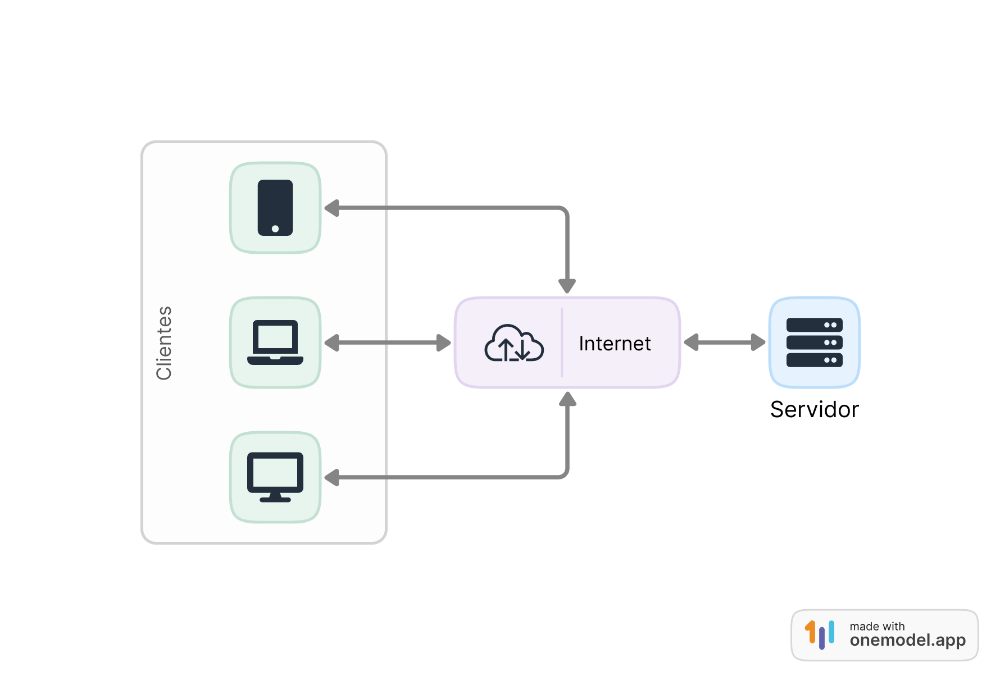
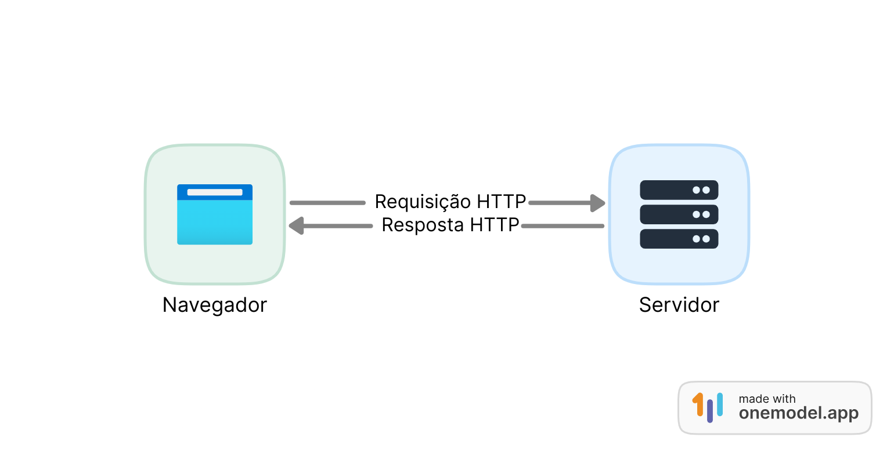

# 2. Fundamentos da Web

Este capítulo visa apresentar os fundamentos da web, seus principais componentes e interação entre eles. Para começar a entender o funcionamento da web precisamos conhecer alguns conceitos e componentes básicos que compõem a web, iniciaremos pelo conceito de arquitetura cliente-servidor.

### 2.1 Arquitetura Cliente-Servidor

A arquitetura cliente-servidor é um modelo de design amplamente utilizado em sistemas de computação, sendo a base para o funcionamento de aplicações web. Nesse modelo, os componentes do sistema são divididos em duas categorias distintas: cliente e servidor. Cada um possui funções específicas e se comunica de forma coordenada para fornecer serviços ou recursos aos usuários.

* **Cliente** é o dispositivo pelo qual o usuário acessa as páginas web. É por meio do cliente que o usuário envia solicitações ao servidor para obter informações, enviar dados, realizar ações, etc.
* **Servidor** é a parte do sistema que fornece os serviços solicitados pelo cliente. São dispositivos que armazenam os arquivos das aplicações web (documentos, imagens, folhas de estilo, arquivos JavaScript, etc.) e disponibilizam esses recursos para serem acessados pelos dispositivos clientes. Além disso, os servidores podem armazenar e manipular dados, executar a lógica de negócios e lidar com outras tarefas complexas.

A conexão entre cliente e servidor é realizada por meio da internet. A Figura 2.1 representa de forma simplificada a comunicação entre eles.

<figure><figcaption><p>Figura 2.1 - Arquitetura cliente-servidor</p></figcaption></figure>

A arquitetura cliente-servidor possui algumas características importantes:

* Distribuição de tarefas: A separação entre cliente e servidor permite a distribuição de tarefas entre as partes, tornando o sistema mais eficiente e escalável. O servidor é responsável por processar e armazenar dados, gerenciar a autenticação de usuários, entre outras tarefas, enquanto o cliente se concentra na apresentação dos dados e na interação com o usuário.
* Independência de plataformas: Como o cliente e o servidor se comunicam por meio de protocolos padronizados, eles podem ser executados em plataformas diferentes. Isso possibilita que o cliente seja executado em dispositivos variados, como computadores, _smartphones_ e _tablets_, enquanto o servidor pode ser hospedado em diferentes ambientes de servidor.
* Flexibilidade e manutenção: A arquitetura cliente-servidor facilita a manutenção do sistema, pois as atualizações e modificações são aplicadas diretamente no servidor e replicadas automaticamente para os clientes. Isso reduz a necessidade de atualizar o software em todos os dispositivos clientes individualmente.

A web implementa arquitetura cliente-servidor por padrão. Os navegadores web atuam como clientes, enviando solicitações HTTP para servidores web que respondem com páginas da web ou recursos solicitados.

### 2.2 Protocolo HTTP

_HTTP_ - _Hypertext Transfer Protocol_ (em português Protocolo de Transferência de Hipertexto) é o idioma de comunicação entre clientes e servidores na web. É um protocolo cliente-servidor utilizado para troca de dados na web, geralmente a troca de mensagens inicia-se pelo cliente (geralmente um navegador web), que envia uma solicitação HTTP ao servidor, especificando o que deseja, e o servidor responde com uma mensagem HTTP contendo o resultado ou a resposta à solicitação.

O protocolo HTTP foi projetado para permitir a troca de informações na web, como páginas web, imagens, vídeos, arquivos, entre outros, de forma eficiente e padronizada.

O funcionamento básico do HTTP é baseado no conceito de solicitação e resposta. Quando o navegador envia uma mensagem de solicitação ao servidor chamamos de **requisição HTTP** (ou _**HTTP**_ _**request**_ em inglês) e quando o servidor responde à requisição chamamos de **resposta HTTP** (ou **HTTP** **response** em inglês), conforme demonstrado na Figura 2.2.

<figure><figcaption><p>Figura 2.2 - Fluxo de mensagens HTTP</p></figcaption></figure>

A seguir serão descritas as principais informações de requisições e respostas HTTP.

#### Requisições HTTP

Uma requisição HTTP é composta pelos seguintes elementos:

* Um **método** HTTP, que define qual operação o cliente quer fazer;
* O **caminho** **do recurso** a ser acessado;
* A **versão do protocolo** HTTP;
* **Cabeçalhos** que contém informações extras para o servidor.
* Opcionalmente, um **corpo** com dados da requisição enviados ao servidor.

Veja um exemplo de requisição HTTP utilizando o navegador Firefox para acessar o endereço web _www.guiaweb.dev.br/pagina-exemplo.html_.

```http
GET /pagina-exemplo.html HTTP/3
Scheme: https
Host: www.guiaweb.dev.br
User-Agent: Mozilla/5.0 (X11; Linux x86_64; rv:109.0) Gecko/20100101 Firefox/115.0 
Accept: text/html,application/xhtml+xml
Accept-Language: en-US,en;q=0.5
Connection: keep-alive
```

Essa é uma requisição HTTP simples, em que o cliente está solicitando uma página da web ao servidor com base na URL fornecida.

Segue a descrição de cada item da requisição HTTP acima:

* `GET`: indica que é uma solicitação do tipo "_GET_". Isso significa que o cliente deseja obter um recurso específico do servidor, no caso, a página "/pagina-exemplo.html".
* `Scheme`: é o protocolo usado na requisição, nesse exemplo foi o https, que é uma versão segura do protocolo http.
* `/pagina-exemplo.html`: é a URL do recurso que o cliente deseja obter. O caminho do recurso é "/pagina-exemplo.html".
* `HTTP/3`: é a versão do protocolo HTTP utilizada na solicitação.
* `Host: www.guiaweb.dev.br`: especifica o nome do servidor para o qual a solicitação está sendo enviada.
* `User-Agent`: informa o navegador ou cliente utilizado para fazer a solicitação. Neste exemplo, o cliente é um navegador Firefox em um sistema Linux.
* `Accept`: indica os tipos de conteúdo que o cliente aceita. Neste caso, o cliente aceita conteúdo no formato "_text/html_" e "_application/xhtml+xml_".
* `Accept-Language`: define as preferências de idioma do cliente. Neste exemplo, o cliente aceita conteúdo em inglês (_en-US_) ou inglês em geral (_en_) com uma preferência menor (q=0.5).
* `Connection`: define as preferências de conexão do cliente. Neste caso, "_keep-alive_" indica que a conexão TCP será mantida aberta para possíveis solicitações futuras.

No exemplo acima, os campos `User-Agent, Accept, Accept-Language, Connection` são classificados como campos de cabeçalho e a requisição não possui corpo.

#### Respostas HTTP

As respostas HTTP consistem dos seguintes elementos:

* A **versão** do protocolo HTTP utilizada.
* Um **código de status**, indicando se a requisição foi bem sucedida, ou não, e por quê.
* Uma **mensagem de status**, uma pequena descrição sobre o código de status.
* **Cabeçalhos** com informações extras para o cliente.
* Opcionalmente, um **corpo com dados do recurso** requisitado.

Veja abaixo o exemplo da resposta HTTP da requisição feita anteriormente.

```http
HTTP/3 200 OK
Server: Apache/2.4.41 (Unix)
Date: Mon, 20 Jun 2023 12:00:00 GMT
Content-Type: text/html; charset=utf-8
Content-Length: 1234
Connection: keep-alive

<!DOCTYPE html>
<html>
<head>
  <title>Página de Exemplo</title>
</head>
<body>
  <h1>Bem-vindo à Página de Exemplo!</h1>
  <p>Esta é uma página de exemplo.</p>
</body>
</html>
```

Essa é a resposta HTTP enviada pelo servidor para a solicitação GET anterior. Ela contém o código de status "200 OK", que indica uma resposta bem-sucedida, e o conteúdo da página solicitada no corpo da resposta. O cliente (navegador web) interpretará essa resposta e exibirá o conteúdo da página para o usuário.

Segue a descrição de cada item da resposta HTTP acima:

* `HTTP/3 200 OK`: indica o código de status da resposta. Neste caso, "200 OK" significa que a solicitação foi bem-sucedida, o servidor encontrou o recurso e enviou-o para o cliente que fez a solicitação.
* `Date`: indica a data e hora em que a resposta foi gerada.
* `Server`: identifica o software do servidor que está respondendo à solicitação. Neste exemplo, o servidor está usando o software "Apache" na versão "2.4.41" em um sistema Unix.
* `Content-Type`: especifica o tipo de conteúdo que está sendo enviado na resposta. Neste caso, o conteúdo é "text/html", indicando que é uma página HTML.
* `Content-Length`: indica o tamanho do conteúdo da resposta em bytes. Neste exemplo, o tamanho é 1234 bytes.
* `Connection`: define as preferências de conexão do servidor. Neste caso, "keep-alive" indica que a conexão TCP será mantida aberta para possíveis solicitações futuras.
* `html`: conteúdo da resposta (corpo), a partir da linha `<!DOCTYPE html>`, segue o conteúdo da página "pagina-exemplo.html". Neste exemplo, é uma página HTML simples com um título e um parágrafo.

No exemplo acima, os campos `Date, Content-Type, Content-Length, Connection` são classificados como campos de cabeçalho.

Além dos dados de requisição e resposta descritos acima, existem outros campos conhecidos como cabeçalhos HTTP enviados tanto na requisição quanto na resposta com informações extras. Não é objetivo deste material detalhar todos os cabeçalhos HTTP, para saber mais acesse [https://developer.mozilla.org/pt-BR/docs/Web/HTTP/Overview](https://developer.mozilla.org/pt-BR/docs/Web/HTTP/Overview).

#### Métodos HTTP

Como visto no exemplo de requisição anterior, na primeira linha de toda requisição HTTP é informado o método utilizado na requisição.

Os métodos HTTP, também conhecidos como verbos HTTP, são usados para indicar a intenção ou ação que o cliente deseja executar para um determinado recurso no servidor. Cada método representa uma operação diferente, com um propósito específico. Os métodos mais comuns são:

* **GET**: é utilizado para solicitar um recurso do servidor. Conhecido como método de consulta.
* **POST**: É utilizado para enviar dados ao servidor para que ele os processe, geralmente como parte de um envio de formulário. Geralmente o servidor cria um novo recurso com base nos dados recebidos via POST.
* **PUT**: é utilizado para enviar dados ao servidor para atualizar um recurso específico. O cliente envia o recurso completo ou uma parte dele e o servidor atualiza o recurso existente com os dados recebidos do cliente.
* **DELETE**: é utilizado para solicitar a exclusão de um recurso específico. O servidor deve excluir o recurso se possível.
* **HEAD**: é semelhante ao método _GET_, mas o servidor não retorna o conteúdo do recurso solicitado. É usado para obter apenas os cabeçalhos da resposta, permitindo ao cliente obter informações sobre o recurso sem transferir os dados completos.
* **OPTIONS**: é utilizado para obter informações sobre as opções de comunicação disponíveis para um recurso específico. O servidor responde com os métodos HTTP permitidos e outras informações relevantes sobre o recurso.

Esses são os métodos HTTP mais comuns e amplamente utilizados. Cada método tem uma finalidade específica e é importante escolher o método correto ao realizar solicitações HTTP para garantir que as operações sejam realizadas de maneira adequada e segura. Para conhecer todos os métodos HTTP acesse a página: [https://developer.mozilla.org/pt-BR/docs/Web/HTTP/Methods](https://developer.mozilla.org/pt-BR/docs/Web/HTTP/Methods).

#### Códigos de status de respostas HTTP

Toda resposta HTTP tem um código de status (número de três dígitos). O código de status da resposta HTTP indica o resultado da operação solicitada na requisição, se foi realizada com sucesso ou se houve algum erro. Os códigos de status são divididos em cinco classes, cada uma com um propósito específico:

* **Códigos de status 1xx (Informational)**: Indicam que a solicitação foi recebida e está sendo processada. Esses códigos são informativos e não exigem ação adicional do cliente.
* **Códigos de status 2xx (Successful)**: Indicam que a solicitação foi bem-sucedida e o servidor conseguiu processá-la conforme solicitado.
* **Códigos de status 3xx (Redirection)**: Indicam que a solicitação precisa de ações adicionais para ser concluída. Esses códigos são usados para redirecionar o cliente para outra URL ou recurso.
* **Códigos de status 4xx (Client Errors)**: Indicam que ocorreu um erro na solicitação feita pelo cliente. Geralmente, esses códigos são retornados quando contém erros na solicitação do cliente ou o recurso solicitado não existe no servidor.
* **Códigos de status 5xx (Server Errors)**: Indicam que ocorreu um erro no servidor ao processar a solicitação do cliente. Esses códigos são enviados quando o servidor encontra uma situação inesperada ou não consegue concluir a solicitação do cliente.

Abaixo estão alguns exemplos de códigos de status de respostas HTTP mais comuns:

* **200 OK**: Indica que a solicitação foi bem-sucedida e o servidor retornou os dados solicitados com sucesso.
* **201 Created**: Indica que a solicitação foi bem-sucedida e o servidor criou um novo recurso conforme solicitado (geralmente é uma resposta para uma solicitação com método POST).
* **301 Moved Permanently**: Indica que o recurso solicitado foi movido permanentemente para outra URL. O cliente deve redirecionar sua solicitação para a nova URL.
* **400 Bad Request**: Indica que a solicitação do cliente é inválida ou malformada.
* **404 Not Found**: Indica que o recurso solicitado não foi encontrado no servidor.
* **500 Internal Server Error**: Indica que ocorreu um erro inesperado no servidor ao processar a solicitação do cliente.

Esses são apenas alguns exemplos dos códigos de status mais comuns. Existem vários outros códigos de status HTTP, cada um com um significado específico. Os códigos de status são importantes para que o cliente (navegador ou aplicativo) possa interpretar a resposta do servidor corretamente e tomar as ações apropriadas com base no resultado da solicitação.

### 2.3 Como a Web funciona

Nesta seção vamos apresentar uma visão simplificada do que acontece quando você acessa uma página em um navegador web no seu dispositivo.

Como vimos no início deste capítulo a web é baseada no modelo cliente-servidor, desta forma, os dispositivos conectados na web são chamados de clientes e servidores:

* Clientes são os dispositivos conectados à internet dos usuários da web e programas de acesso à web disponíveis nesses dispositivos (geralmente um navegador como Firefox ou Chrome).
* Servidores são computadores que armazenam páginas, sites ou aplicativos.

Dessa forma, quando o dispositivo de um cliente quer acessar uma página, ele faz uma solicitação ao servidor e uma cópia dessa página é baixada do servidor para a máquina do cliente para ser apresentada no navegador web do usuário.

A Web funciona por meio da interconexão de clientes e servidores em todo o mundo, seguindo um conjunto de protocolos e padrões que facilitam a troca de informações entre eles. Vamos explorar os principais elementos que compõem o funcionamento da Web:

* **Protocolos e Padrões**: a Web utiliza vários protocolos e padrões para facilitar a comunicação entre os dispositivos. O Protocolo de Transferência de Hipertexto (HTTP) é um dos principais protocolos que permite que os clientes (como navegadores web) solicitem recursos a servidores via URLs (Uniform Resource Locators). Outros protocolos, como o Protocolo de Transferência de Hipertexto Seguro (HTTPS), são usados para comunicações seguras e criptografadas.
* **Navegadores Web**: os navegadores web, como Google Chrome, Mozilla Firefox, Microsoft Edge, Safari, entre outros, são aplicativos utilizados pelos usuários para acessar a Web. Eles interpretam e exibem páginas da web, fornecendo uma interface gráfica para interagir com os recursos disponíveis na internet.
* **Servidores Web**: os servidores web são computadores que hospedam e disponibilizam recursos na Web, como páginas HTML, imagens, arquivos, entre outros. Eles respondem a solicitações dos clientes (navegadores) e enviam as respostas com os recursos solicitados.
* **URLs (Uniform Resource Locators)**: as URLs são endereços que identificam recursos específicos na Web. Quando um usuário digita uma URL no navegador ou clica em um link, o navegador envia uma solicitação para o servidor correspondente, solicitando o recurso associado àquela URL.
* **Hiperlinks**: _Hhperlinks_ ou simplesmente _links_ são elementos interativos em páginas da web que permitem que os usuários naveguem para outras páginas e recursos na Web. Eles conectam diferentes partes da Web, criando uma teia de informações interconectadas.
* **Servidores de Nomes de Domínio (DNS)**: o DNS é um sistema que associa nomes de domínio (como [exemplo.com](http://exemplo.com)) a endereços IP numéricos utilizados pelos servidores web. Quando um usuário digita um nome de domínio no navegador, o sistema DNS traduz esse nome em um endereço IP para localizar o servidor correto.
* **HTML, CSS e JavaScript**: as páginas da web são criadas utilizando-se linguagens de marcação como HTML (Hypertext Markup Language) para estruturar o conteúdo, CSS (Cascading Style Sheets) para definir a aparência e o layout, e JavaScript para adicionar interatividade e dinamismo às páginas.
* **Rede e Infraestrutura**: a Web é suportada por uma infraestrutura de rede global (conhecida como internet), que inclui uma série de cabos submarinos, roteadores, servidores e outros dispositivos que possibilitam a transmissão de dados entre diferentes partes do mundo.

A Figura 2.3 apresenta uma visão forma simplificada do fluxo de comunicação entre cliente e servidor ao acessar uma página web. Vamos usar como exemplo o acesso à página web identificada pela URL [https://guiaweb.dev.br/](https://guiaweb.dev.br/). Inicialmente vamos detalhar a URL:

* `https`**:** protocolo (obrigatório), informa ao navegador qual o protocolo de comunicação, pode ser `http` ou `https`. Quando não digitamos na barra de endereço, o próprio navegador preenche.
* `guiaweb.dev.br`**:** domínio (obrigatório), é basicamente o nome (identificador) do site. Deve ser informado pelo usuário na barra de endereços do navegador.
* `/` recurso (obrigatório) - identifica qual o recurso o navegador vai buscar no servidor, quando não é informado pelo usuário o próprio navegador preenche com uma "/", que significa página inicial do site.

<figure><figcaption><p>Figura 2.3 - Fluxo de mensagens ao acessar uma página Web</p></figcaption></figure>

Segue a explicação de cada passo mostrado na figura acima:

1. O navegador pergunta ao DNS qual o endereço IP do servidor onde o site do domínio informado na barra de endereço (`guiaweb.dev.br`) está hospedado.
2. O DNS retorna o endereço IP daquele site conforme o domínio;
3. O navegador manda uma mensagem de requisição HTTP para o servidor que está hospedando o site, pedindo que o servidor envie uma cópia de determinada página, de acordo com a URL informada pelo usuário.
4. Se o servidor aprovar a requisição do cliente, o servidor enviará ao cliente uma mensagem de "OK", e então começa a enviar os arquivos da página solicitada para o navegador.
5. O navegador carrega os arquivos recebidos (HTML, CSS, JS, etc.), monta a página e exibe-a para o usuário.

A Web funciona de forma descentralizada e distribuída, permitindo que milhões de servidores e bilhões de dispositivos estejam interconectados. Essa interconexão global (internet) possibilita o acesso rápido e fácil a informações, serviços e recursos, tornando a Web uma das maiores e mais influentes inovações tecnológicas da história moderna.

### 2.4 Conclusão

Os principais pilares dos fundamentos da web incluem os protocolos e padrões que regem a comunicação entre dispositivos e servidores, como o HTTP, HTTPS e o DNS. Além disso, a web é impulsionada pelas linguagens de marcação (HTML), estilos (CSS) e programação (JavaScript) que dão vida às páginas e permitem uma experiência interativa e dinâmica para os usuários.

Os navegadores web desempenham um papel fundamental ao oferecer uma interface amigável para acessar e visualizar recursos na web.

Já os servidores web, por sua vez, hospedam e disponibilizam conteúdo, respondendo às solicitações dos clientes e tornando a web uma teia de informações interligadas.

Os fundamentos da web estão em constante evolução, impulsionados por novas tecnologias, padrões e tendências. A web continua a se adaptar e crescer, oferecendo novas possibilidades, como aplicações web progressivas (PWAs), realidade virtual e aumentada, _blockchain_ e muito mais.

**Compreender os fundamentos da web é essencial** para qualquer pessoa que deseja trabalhar com desenvolvimento de aplicações web. Com uma base sólida nos fundamentos da web, é possível desenvolver aplicações acessíveis, seguras e eficientes, contribuindo para o contínuo avanço e sucesso da web no futuro.

