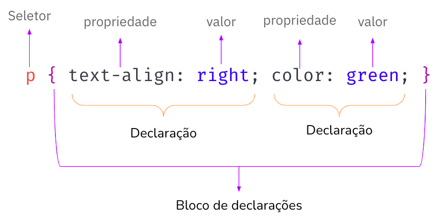

# CSS

> **Objetivos de aprendizagem**
>
> * Conhecer a linguagem de estilo CSS
> * Entender a sintaxe básica da linguagem CSS
> * Conhecer as propriedades básicas da CSS

### Introdução

CSS - Cascading Style Sheets \(Folha de Estilos em Cascata em português\), é uma linguagem de estilo utilizada para definir a apresentação de documentos escritos em uma linguagem de marcação, como HTML. O CSS formata a informação entregue pelo HTML. Essa informação pode ser qualquer coisa: imagem, texto, vídeo, áudio ou qualquer outro elemento criado. 

> CSS descreve como os elementos HTML devem ser exibidos. Quando um navegador vai exibir uma página Web ele lê o conteúdo do HTML e a formatação do CSS. HTML e CSS se completam.

O CSS separa o conteúdo da representação visual do site, isso significa que o CSS permite aplicar estilos seletivamente a elementos em documentos HTML. Por exemplo, para que todos os elementos do tipo parágrafo \(`<p>`\) de uma página HTML tenham o seu conteúdo \(texto\) alinhado à direita, seria necessário este CSS:

```css
p {
    text-align: right;
}
```

### Como vincular o CSS ao HTML

Há basicamente três formas de aplicar CSS a um documento HTML:

1. _**Inline -**_ o código CSS é adicionado diretamente no elemento HTML através do atributo style. Exemplo: `<p style="text-align: right; ">texto</p>.` Esta forma é considerada uma má prática, pois mistura o código HTML com CSS e não permite a reutilização de código, tornando a manutenção e evolução do código mais complexa. Portanto, EVITE! 
2. **Interno** - o código CSS é colocado dentro de uma elemento &lt;style&gt;, geralmente dentro do &lt;head&gt;. Exemplo: `<style type="text/css">   p { text-align: right; } </style>.`Esta forma também é considerada uma má prática, pois coloca o código HTML com CSS em um mesmo arquivo e não permite a reutilização do CSS entre arquios HTML diferentes, que pode gerar duplicidade de código e tornar a manutenção mais trabalhosa. Portanto, EVITE! 
3. **Externo** - o código CSS é colocado em um arquivo `.css`, separadamente do arquivo HTML. Nesse caso é necessário vincular o arquivo CSS no arquivo HTML. A ligação entre o HTML e CSS é realizada por meio do elemento link, que deve ser adicionado no elemento `<head>`. Veja o exemplo abaixo, onde o arquivo `style.css` está vinculado ao arquivo `index.html`:



```markup
<!DOCTYPE html>
<html>
 
 <head>
   <link rel="stylesheet" href="style.css">
 </head>

 <body>
   <p>Olá mundo, HTML!</p>
 </body>

</html>

```



```css
p {
    text-align: right;
}
```



Como pode ser visto no exemplo acima, o elemento &lt;link&gt; recebe dois atributos obrigatórios referentes ao arquivo CSS que será vinculado. O atributo `rel="stylesheet"`  especifica que o documento vinculado é um CSS e o atributo `href`  recebe como valor a localização \(_link_\) do arquivo CSS a ser vinculado.

Dessa forma, todo código CSS adicionado no arquivo style.css está vinculado ao arquivo index.html. 

Agora vamos entender sobre a sintaxe do CSS, sua anatomia básica.

### Sintaxe do CSS

Podemos as instruções CSS como um conjunto de regras de formatação para serem aplicadas às páginas Web.

A sintaxe das regras do CSS é formada por um **seletor** e **bloco de declarações**, dentro de um bloco de declarações pode haver várias declarações, cada declaração é composta por  **propriedade** e **valor.** Veja a imagem abaixo.



Vamos entender detalhadamente cada item da sintaxe do CSS.

* O **seletor** seleciona quais elementos  HTML receberão o estilo definido no bloco de declarações. No exemplo da figura acima, todos os elementos `<p>` \(paragrafo\) serão estilizados conforme o bloco de declarações.
* O **bloco de declaração**, delimitado por chaves `{}`, contém uma ou mais declarações separadas por ponto e vírgula.
* Cada declaração inclui um nome de **propriedade** CSS e um **valor**, separados por **dois pontos**.
* As propriedades `text-align` e `color` são utilizadas para definir o alinhamento do texto e cor do texto respectivamente. No exemplo da imagem acima, para o `text-align` foi atribuído o valor `right`, que alinha o texto à direita e para a `color` foi atribuído o valor `green`, que deixa a cor de texto verde.  

Veja mais sobre seletores, propriedades e valores na próxima seção.

### Seletores, propriedades e valores

Aplicação de CSS é feita por Seletores. Os seletores CSS são usados para "encontrar" \(ou selecionar\) elementos HTML com base no nome do elemento, id, classe, etc.

Há muitos tipos diferentes de seletores. Abaixo, é mostrado os **seletores de elementos**, que selecionam todos os elementos de um determinado tipo nos documentos HTML. No entanto, é possível fazer seleções mais específicas.  Veja abaixo alguns dos tipos mais comuns de seletores:

<table>
  <thead>
    <tr>
      <th style="text-align:left">Seletor</th>
      <th style="text-align:left">Exemplo</th>
      <th style="text-align:left">O que ele seleciona</th>
    </tr>
  </thead>
  <tbody>
    <tr>
      <td style="text-align:left">tag</td>
      <td style="text-align:left"><code>p { } </code>
        <br />Seleciona os elementos html <code> &lt;p&gt;</code>
      </td>
      <td style="text-align:left">Todos os elementos HTML de determinado tipo (tag). Qualquer tag/elemento
        pode ser usada como seletor.</td>
    </tr>
    <tr>
      <td style="text-align:left">id</td>
      <td style="text-align:left"><code>#my-id {  } </code>
        <br />Seleciona o elemento html <code>&lt;p id=&quot;my-id&quot;&gt;..&lt;/p&gt;</code>
      </td>
      <td style="text-align:left">O elemento na p&#xE1;gina com o id espec&#xED;ficado. S&#xF3; deve haver
        um elemento com o mesmo ID por p&#xE1;gina HTML. O seletor de id inicia
        com uma hashtag <code>#</code>.</td>
    </tr>
    <tr>
      <td style="text-align:left">classe</td>
      <td style="text-align:left">
        <p><code>.my-class {  } </code>Seleciona os elementos html <code>&lt;p class=&quot;my-class&quot;&gt;..&lt;/p&gt;</code>
        </p>
        <p><code>&lt;h1 class=&quot;my-class&quot;&gt;..&lt;/h1&gt;</code>
        </p>
      </td>
      <td style="text-align:left">O(s) elemento(s) na p&#xE1;gina com a classe espec&#xED;ficada. V&#xE1;rios
        elementos podem possuir a mesma classe. O seletor de classe inicia com
        um ponto <code>.</code> .</td>
    </tr>
    <tr>
      <td style="text-align:left">pseudo-classe</td>
      <td style="text-align:left"><code>a:hover</code>
        <br />Seleciona <code>&lt;a&gt;</code>, mas somente quando o mouse est&#xE1;
        em cima do elemento <code>&lt;a&gt; </code>(link).</td>
      <td style="text-align:left">O(s) elemento(s) espec&#xED;ficado(s), mas somente quando estiver no estado
        especificado. No exemplo &#xE9; utilizado o hover que &#xE9; um estado
        ativado quando o mouse est&#xE1; sobre o elemeto. O seletor de pseudo-classe
        &#xE9; definido com o nome do seletor, dois pontos e o estado, ex.: <code>seletor:estado</code> .</td>
    </tr>
  </tbody>
</table>


### Referências






