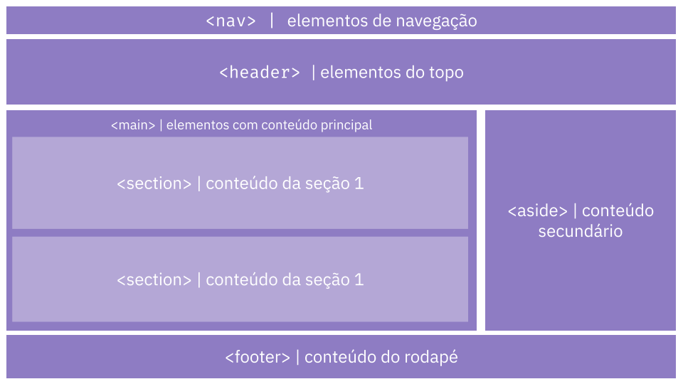

# CSS

> **Objetivos de aprendizagem**
>
> * Conhecer a linguagem de estilo CSS
> * Entender a sintaxe básica da linguagem CSS
> * Conhecer as propriedades básicas da CSS

### Introdução

CSS - Cascading Style Sheets \(Folha de Estilos em Cascata em português\), é uma linguagem de estilo utilizada para definir a apresentação de documentos escritos em uma linguagem de marcação, como HTML. O CSS formata a informação entregue pelo HTML. Essa informação pode ser qualquer coisa: imagem, texto, vídeo, áudio ou qualquer outro elemento criado. 

> CSS descreve como os elementos HTML devem ser exibidos. Quando um navegador vai exibir uma página Web ele lê o conteúdo do HTML e a formatação do CSS. HTML e CSS se completam.

O CSS separa o conteúdo da representação visual do site, isso significa que o CSS permite aplicar estilos seletivamente a elementos em documentos HTML. Por exemplo, para que todos os elementos do tipo parágrafo \(`<p>`\) de uma página HTML tenham o seu conteúdo \(texto\) alinhado à direita, seria necessário este CSS:

```css
p {
    text-align: right;
}
```

### Como vincular o CSS ao HTML

Há basicamente três formas de aplicar CSS a um documento HTML:

1. _**Inline -**_ o código CSS é adicionado diretamente no elemento HTML através do atributo style. Exemplo: `<p style="text-align: right; ">texto</p>.` Esta forma é considerada uma má prática, pois mistura o código HTML com CSS e não permite a reutilização de código, tornando a manutenção e evolução do código mais complexa. Portanto, EVITE! 
2. **Interno** - o código CSS é colocado dentro de uma elemento &lt;style&gt;, geralmente dentro do &lt;head&gt;. Exemplo: `<style type="text/css">   p { text-align: right; } </style>.`Esta forma também é considerada uma má prática, pois coloca o código HTML com CSS em um mesmo arquivo e não permite a reutilização do CSS entre arquios HTML diferentes, que pode gerar duplicidade de código e tornar a manutenção mais trabalhosa. Portanto, EVITE! 
3. **Externo** - o código CSS é colocado em um arquivo `.css`, separadamente do arquivo HTML. Nesse caso é necessário vincular o arquivo CSS no arquivo HTML. A ligação entre o HTML e CSS é realizada por meio do elemento link, que deve ser adicionado no elemento `<head>`. Veja o exemplo abaixo, onde o arquivo `style.css` está vinculado ao arquivo `index.html`:



```markup
<!DOCTYPE html>
<html>
 
 <head>
   <link rel="stylesheet" href="style.css">
 </head>

 <body>
   <p>Olá mundo, HTML!</p>
 </body>

</html>

```



```css
p {
    text-align: right;
}
```



Como pode ser visto no exemplo acima, o elemento &lt;link&gt; recebe dois atributos obrigatórios referentes ao arquivo CSS que será vinculado. O atributo `rel="stylesheet"`  especifica que o documento vinculado é um CSS e o atributo `href`  recebe como valor a localização \(_link_\) do arquivo CSS a ser vinculado.

Dessa forma, todo código CSS adicionado no arquivo style.css está vinculado ao arquivo index.html. 

Agora vamos entender sobre a sintaxe do CSS, sua anatomia básica.

### Sintaxe do CSS

Podemos as instruções CSS como um conjunto de regras de formatação para serem aplicadas às páginas Web.

A sintaxe das regras do CSS é formada por um **seletor** e **bloco de declarações**, dentro de um bloco de declarações pode haver várias declarações, cada declaração é composta por  **propriedade** e **valor.** Veja a imagem abaixo.


Vamos entender detalhadamente cada item da sintaxe do CSS.

* O **seletor** seleciona quais elementos  HTML receberão o estilo definido no bloco de declarações. No exemplo da figura acima, todos os elementos `<p>` \(paragrafo\) serão estilizados conforme o bloco de declarações.
* O **bloco de declaração**, delimitado por chaves `{}`, contém uma ou mais declarações separadas por ponto e vírgula.
* Cada declaração inclui um nome de **propriedade** CSS e um **valor**, separados por **dois pontos**.
* As propriedades `text-align` e `color` são utilizadas para definir o alinhamento do texto e cor do texto respectivamente. No exemplo da imagem acima, para o `text-align` foi atribuído o valor `right`, que alinha o texto à direita e para a `color` foi atribuído o valor `green`, que deixa a cor de texto verde.  

Resumo sobre a sintaxe do CSS:

* `{}` \(chaves\) determina o inicio e o fim de um bloco de declarações; 
* `:` \(dois pontos\) separa a propriedade do valor;
* `;` \(ponto e vírgula\) encerra uma declaração; 
* **Ambos são obrigatórios.**

Veja mais sobre seletores, propriedades e valores na próxima seção.

### Seletores

Aplicação de CSS é feita por Seletores. Os seletores CSS são usados para "encontrar" \(ou selecionar\) elementos HTML com base no nome do elemento, id, classe, etc.

Há muitos tipos diferentes de seletores. Abaixo, é mostrado os **seletores de elementos**, que selecionam todos os elementos de um determinado tipo nos documentos HTML. No entanto, é possível fazer seleções mais específicas.  Veja abaixo alguns dos tipos mais comuns de seletores:

<table>
  <thead>
    <tr>
      <th style="text-align:left">Seletor</th>
      <th style="text-align:left">Exemplo</th>
      <th style="text-align:left">O que ele seleciona</th>
    </tr>
  </thead>
  <tbody>
    <tr>
      <td style="text-align:left">tag ou elemento</td>
      <td style="text-align:left">
        <p><code>p { </code>
        </p>
        <p><code>} </code>
        </p>
      </td>
      <td style="text-align:left">Todos os elementos HTML de determinado tipo (tag). Qualquer tag/elemento
        pode ser usada como seletor.</td>
    </tr>
    <tr>
      <td style="text-align:left">id</td>
      <td style="text-align:left"><code>#my-id {  } </code>
      </td>
      <td style="text-align:left">O elemento na p&#xE1;gina com o id espec&#xED;ficado. S&#xF3; deve haver
        um elemento com o mesmo <code>id</code> por p&#xE1;gina HTML. O seletor de
        id inicia com uma hashtag <code>#</code>.</td>
    </tr>
    <tr>
      <td style="text-align:left">classe</td>
      <td style="text-align:left"><code>.my-class { } </code>
      </td>
      <td style="text-align:left">O(s) elemento(s) na p&#xE1;gina com a classe espec&#xED;ficada. V&#xE1;rios
        elementos podem possuir a mesma classe. O seletor de classe inicia com
        um ponto <code>.</code> .</td>
    </tr>
    <tr>
      <td style="text-align:left">pseudo-classe</td>
      <td style="text-align:left">
        <p><code>a:hover { </code>
        </p>
        <p><code>}</code>
        </p>
      </td>
      <td style="text-align:left">O(s) elemento(s) espec&#xED;ficado(s), mas somente quando estiver no estado
        especificado. No exemplo &#xE9; utilizado o hover que &#xE9; um estado
        ativado quando o mouse est&#xE1; sobre o elemeto. O seletor de pseudo-classe
        &#xE9; definido com o nome do seletor, dois pontos e o estado, ex.: <code>seletor:estado</code> .</td>
    </tr>
  </tbody>
</table>

### Propriedades e Valores

Propriedade é a forma pela qual você estiliza um elemento HTML. Cada propriedade está relacionada a uma característica que pode ser modificada no elemento HTML. 

Valor da propriedade é a forma pela qual você define o estilo para determinada propriedade, afetando diretamente a aparência do elemento HTML. 

Abaixo é apresentado alguns exemplos de propriedades e valores. Os comentários descrevem cada propriedade listada. Comentários em CSS é definido entre barras e asterisco, como:`/* comentários */`



```css

/* CSS aplicado ao elemento body, ou seja, aplicato a página toda */
body { 
    text-align: center; /* deixa o texto centralizado */
    color: green; /* define a cor de todo texto da página como verde */
    font-size: 16px; /*d efine o tamanho da fonte do texto */
}
```



```markup
<!DOCTYPE html>
<html>
 
 <head>
   <meta charset="UTF-8">
   <title>Webdev book</title>
   <link rel="stylesheet"  href="css/style.css">
 </head>

 <body>
  <h2>Olá CSS, vamos pra aula!</h2>
 </body>

</html>
```



Como pode ser visto nos comentários do código CSS acima, algumas propriedades do CSS são específicas para determinados tipos de elementos HTML, como `text-align`, `color`   e `font-size`, que só fazem efeitos em elementos de texto. Já outras podem ser aplicadas com efeitos em qualquer elemento, tais como `width`, `margin`, etc. Vamos ver mais detalhes sobre elas na próxima seção. 

Não tente decorar todas as propriedades e valores do CSS, são muitas propriedades e para cada propriedade pode haver infinitas possibilidades de valores, o importante é entender a sintaxe e ir utilizando de acordo com o que você deseja fazer. 

Vale destacar que para maioria das propriedades existem um conjunto de valores pré-definidos. Veja todas as propriedades e valores do CSS aqui: [https://developer.mozilla.org/pt-BR/docs/Web/CSS/Reference](https://developer.mozilla.org/pt-BR/docs/Web/CSS/Reference).

### No HTML tudo é box \(caixa\)

A maioria dos elementos HTML podem ser pensados como caixas, que podem ser agrupadas de forma horizontal, vertical ou colocada dentro de outra. Ao trabalhar com as propriedades CSS isso fica mais evidente, frequentemente você precisará indicar o tamanho dos elementos\(largura e altura\), cor, posição em relação aos demais e seu conteúdo interno, etc.

O box \(caixa\) que representa um elemento HTML é composto por **conteúdo**, **margem interna** \(`padding`\), **borda** \(`border`\) e **margem externa** \(`margin`\). Todas essas partes que compõe o elemento é conhecida como _**box model.**_ A figura abaixo tem a representação gráfica de um elemento.


Diante do apresentado acima,  agora sabemos que cada elemento HTML que ocupa um espaço na sua página tem propriedades como essas:

* `width` - largura de um elemento, pode ser definido com valor fixo usando píxel \(px\) ou valor dinâmico usando porcentagem \(%\);
* `height` - altura de um elemento, pode ser definido com valor fixo usando píxel \(px\) ou valor dinâmico usando porcentagem \(%\);
* `margin` - espaço externo a um elemento.
* `border` - linha que envolve todo o elemento.
* `padding` - espaço entre a borda e o conteúdo.
* `background-color` - a cor de fundo do elemento, as propriedades de cores podem receber valores literais \(nome da cor em inglês\), ou cores em hexadecimal \(aquelas que começam \#\) ou cores RGB 

Abaixo um exemplo de código aplicando essas propriedades CSS.



```css
/* CSS aplicado a todos elementos que possuem a classe 'retangulo' */
.retangulo {
    width: 400px; /*  define a largura do elemento */
    height: 200px; /*  define a altura do elemento */
    border: 1px solid red; /* define uma borda sólida vermelha na largura de 1px para todos os lados do elemento */
    background-color: #eee; /* define a cor de fundo do elemento  */
    padding: 10px; /*  define uma distância interna entre as bordas do elemento e seu conteúdo */
    margin: 5px; /*  define uma distância externa  entre as bordas do elemento os demais em volta*/
}

```



```markup
<!DOCTYPE html>
<html>
 
 <head>
   <meta charset="UTF-8">
   <title>IFPI Campus Picos</title>
   <link rel="stylesheet"  href="css/style.css">
 </head>

 <body>
  <div class="retangulo">
    <p>By Jesiel Viana</p>
  </div>
 </body>

</html>
```



As propriedades `padding`, `margin` e `border` são aplicadas aos quatro lados de um elemento: topo, direita, baixo e esquerda. No exemplo acima, essas propriedades receberam apenas um valor, com isso esse valor é aplicado a todos os lados do elemento, no entanto, é possível especificar valor específico para cada lado. Para as propriedades `margin` e `padding` há duas formas de fazer isso.

Atribuindo valores separadas por espaço referentes a cada lado, conforme o exemplo: 

```css
seletor {
    padding: 2px 5px 3px 4px; 
    margin: 5px 7px;
}
```

Quando é atribuído quatro valores, eles são aplicados a cada lado de acordo com a seguinte ordem: primeiro valor é para o topo, segundo valor é para a direita, terceiro é para baixo e o último é aplicado a esquerda. No exemplo acima,  o `padding` aplicado é `2px` para o topo, `5px` para a direita, `3px` para baixo e `4px` para esquerda.

Já quando é atribuído dois valores, o primeiro é aplicado na vertical \(topo e baixo\) e o segundo é aplicado à horizontal \(direita e esquerda\). No exemplo acima,  a `margin` aplicada é `5px` para o topo e baixo e `7px` para esquerda e direita.

A outra forma é que o CSS tem propriedades específicas para cada lado, podendo ser utilizadas em conjunto ou individualmente.

* Propriedades individuais de `margin`:
  * `margin-top`
  * `margin-right`
  * `margin-bottom`
  * `margin-left`
* Propriedades individuais de `padding`:
  * `padding-top`
  * `padding-right`
  * `padding-bottom`
  * `padding-left`
* Propriedades individuais de `border`
  * `border-top`
  * `border-right`
  * `border-bottom`
  * `border-left`

As propriedades de borda \(`border`\) recebem três valores: largura da borda, tipo da borda e cor da borda.

Veja um exemplo utilizando as propriedades específicas para cada lado. 

```css
seletor {
  margin-top: 100px;
  margin-bottom: 30px;
  margin-right: 150px;
  margin-left: 50px;
  
  margin-top: 100px;
  padding-left: 80px;
  
  border-bottom: 1px solid #000;
}
```

Quando utilizamos as propriedades `padding`, `margin` e `border` , estamos usando a forma abreviada das propriedades individuais, com isso deixamos o código mais curto e limpo, facilitando a manutenção do mesmo. Sempre que possível utilize a forma abreviada, só recomendo a utilização das propriedades individuais quando realmente for necessário fazer customizações para lados específicos do elemento.

### CSS para o Layout de elementos semânticos

No capítulo anterior foi criado um layout HTML utilizando elementos semânticos, porém ficou faltando o CSS para estilizar a página conforme a figura. Abaixo é apresentado a figurao do layout, o código e HTML e também o código CSS.







```markup
<!DOCTYPE html>
<html>
 
 <head>
   <meta charset="UTF-8">
   <title>IFPI Campus Picos</title>
   <link rel="stylesheet" type="text/css" href="style.css">
 </head>

 <body>

  <nav>
    Elementos de Menu
  </nav>

  <header>
    Elementos do Topo
  </header>

  <main>
    <section>
      Conteúdo da Seção 1
    </section>

    <section>
      Conteúdo da Seção 2
    </section>
  </main>

  <aside>
    Conteúdo secundário 
  </aside>

  <footer>
    Conteúdo do Rodapé - 2021
  </footer>

 </body>

</html>
```



```css
/* Usa-se o * para definir um CSS a ser aplicado a todos os elementos da página */

* {
  box-sizing: 0;
}

/* CSS para os elmenetos nav, header, main, aside, footer.
Quando temos declarações de CSS comun a vários elementos/seletores
podemos colocar os seletores separados por vírgular para recebers as declarações.
  */
nav, header, main, aside, footer {
  background-color: #8e7cc3;
  text-align: center;
  margin-bottom: 5px;
  padding: 5px;
  color: #fff;
}

nav {
  height: 40px;
}

header {
  height: 100px;
}

main, aside {
  min-height: 450px;
}

main {
  width: 73%;
  margin-right: 1%;
  float: left;
}

section {
  margin-top: 20px;
  width: 100%;
  height: 200px;
  background-color: #b4a7d6;
}

aside {
  width: 23%;
  float: right;
}

footer {
  clear: both;
  height: 60px;
}

```



### Conclusão

Neste capítulo conhecemos a CSS,  linguagem que usamos para definir o estilo de um documento HTML. Utilizamos CSS para definir como os elementos HTML devem ser exibidos pelo navegador.

Foi possível entender a sintaxe da CSS, sua importância e também aprendemos algumas de suas propriedades básicas e como utilizá-las.  

É importante usar CSS para separar o conteúdo de uma página Web da representação visual do site. Utilizando o CSS é possível alterar o tamanho dos elementos HTML, cores de fundo, alinhamento, cor do texto, fonte e espaçamento entre elementos.

Por fim, recomendo os materiais complementares para aprofundamento no assunto.

### Atividade

Construir uma página web pessoal \(portfólio\) baseado nesses exemplos de layout: [https://www.w3schools.com/html/html\_layout.asp](https://www.w3schools.com/html/html_layout.asp)

**Requisitos mínimos:**

* Ter pelo menos quatro divisões semânticas \(header, aside, main, footer\)
* Ter conteúdo em todas as partes do site
* Ter pelo menos uma imagem
* Ter pelo menos um link externo
* Ter textos de cabeçalho, parágrafo e listas

### Materiais complementares









### Referências





