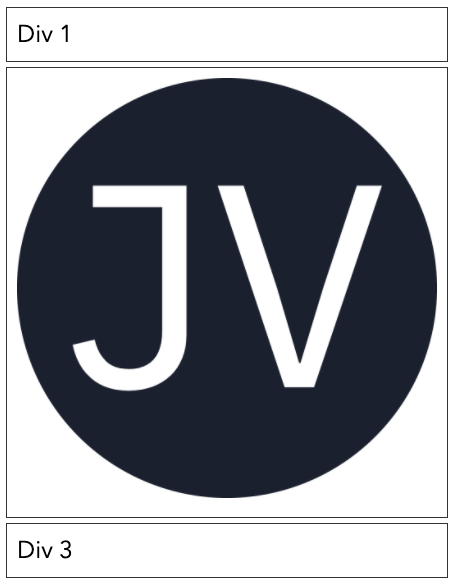
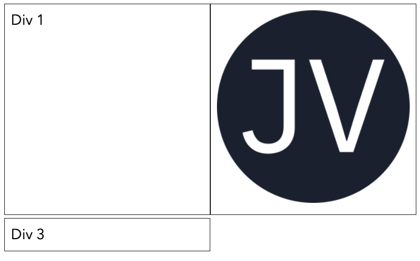
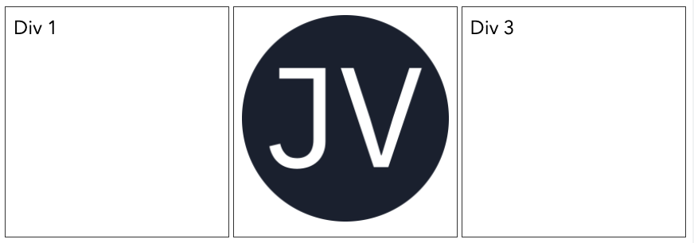

# Web Design Responsivo

#### Introdução

**Design responsivo é feito por meio do CSS, portanto o conhecimento de CSS é um pré-requisito para este capítulo.**

O termo design responsivo foi [cunhado por Ethan Marcotte em 2010](https://alistapart.com/article/responsive-web-design/), e descreveu o uso de três técnicas combinadas \(**layout fluído, media queries e imagens flexíveis**\) para construção de **layouts flexíveis que se adapta a diferentes tamanhos de tela**, em especial a diferentes resoluções. As três técnicas que formam o design responsivo são:

#### **Layout fluído**

Uso de medidas flexíveis relacionadas ao tamanho da tela/resolução do dispositivo. Basicamente é implementado pela definição do tamanho e posicionamento dos elementos usando porcentagens \(`%`\) em vez de pixels. 

As porcentagens preservam o tamanho e o alinhamento de um elemento em relação ao elemento pai, quando o elemento pai sofre alteração de tamanho devido à tela do dispositivo, o elemento filho também muda para se adaptar as novas medidas, mantendo a porcentagem relativa ao pai.

Veja abaixo, um exemplo de layout fluído \(CSS e HTML\) :



```css
body{
    width: 100%;
}

div{
    width: 75%
}
```



```markup
<body>
    <div> Div Layout Fluído </div>
</body>
```



No exemplo acima, o `body` ocupa a largura total da tela do dispositivo \(`100%`\) e já a `div` ocupa `75%` do `body` e consequentemente `75%` da tela do dispositivo onde a página está sendo exibida, independente do tamanho da tela.

#### **Imagens flexíveis**

são imagens que não ultrapassam o tamanho do elemento pai \(contêiner\), mesmo quando o seu tamanho original é maior que o contêiner. Tecnicamente isso é feito por meio do CSS, adicionando a propriedade `max-width : 100%` a imagem. Assim, o tamanho da imagem será no máximo do tamanho do seu elemento pai.

Veja abaixo, um exemplo de imagem flexível \(CSS e HTML\) :



```css
div{
    width: 250px;
}

img{
    max-width: 100%;
}
```



```markup
<div>
    
</div>
```



No exemplo acima, tem uma `div` com largura de `250px` e dentro dela uma imagem. Se a imagem for **menor** que `250px` ela ficará com seu tamanho original na tela, se a imagem for **maior** que `250px` ela será redimensionada para caber dentro da `div`, pois ela está com a **propriedade CSS** `max-width: 100%`, isso implica que a **imagem dentro** da `div` nunca será exibida maior que o tamanho da `div` \(`250px`\), independente do tamanho da tela do dispositivo de acesso.

#### **Media Queries**: 

Possibilitam sobrescrever propriedades do CSS dependendo do tamanho e/ou resolução do dispositivo. Com isso, é possível definir pontos de quebra \(_breakpoints_\) para sobrescrita de propriedades do CSS, que são carregados dependendo do tamanho/resolução do dispositivo.

As media queries permitem que um documento HTML detecte o tamanho e a orientação da janela de visualização e aplique diferentes estilos e atributos de acordo com o tamanho/resolução da tela e os _breakpoints_ definidos. 

Por exemplo, um telefone pode exibir o conteúdo em uma página Web em coluna única, enquanto um tablet pode exibir o mesmo conteúdo em duas colunas e um desktop pode exibir em três colunas. Essas alterações, chamadas substituições, ocorrem para tamanhos ou intervalos de tamanho especificados nas media queries.

Veja abaixo um exemplo completo de design responsivo com layout fluído, imagens responsivas e media queries \(CSS e HTML\) :



```css
* {
  box-sizing: border-box; 
}

body {
  display: flex;
  flex-wrap: wrap;
  justify-content: space-between;
  width: 100%;
  font-size: 1.5rem;
}

div {
  width: 100%;
  border: 1px solid #333;
  margin-bottom: 5px;
  padding: 10px;
}

img {
  max-width: 100%;
}

@media (min-width: 540px) {
  div {
    width: 50%;
  }
}

@media (min-width: 720px) {
  div {
    width: 33%;
  }
}

```



```markup
<!DOCTYPE html>
<html lang="pt-br">

<head>
  <meta charset="UTF-8">
  <meta name="viewport" content="width=device-width">
  <title>Web Design Responsivo</title>
  <link rel="stylesheet" href="estilo.css">
</head>

<body>
  <div>Div 1</div>
  <div>
    
  </div>
  <div>Div 3</div>
</body>

</html>
```



Inicialmente vale destacar que para o funcionamento de _media queries_ exige-se a adição da meta tag `viewport` dentro do `head` da página HTML conforme o exemplo `<meta name="viewport" content="width=device-width">.`

A `viewport` é a área visível do usuário em uma página da web. Ela varia de acordo com o tamanho da tela do dispositivo, por exemplo: será menor em um telefone celular do que em uma tela de computador. 

O `content` da tag `viewport` que no exemplo acima é `width=device-width` define que a largura da página deve seguir a largura da tela do dispositivo \(que irá variar dependendo do tamanho da tela\). Portanto, para que as media queries do CSS sejam carregadas aplicadas de forma correta é necessário a inserção da tag `viewport` na página HTML, conforme o exemplo acima.

Agora vamos explicar  as técnicas de design responsivo aplicadas no código CSS do exemplo acima.

Da linha 1 até a linha 22 está o CSS padrão para a tela com layout fluído, utilizando medidas em porcentagem para `body` e `div` nas linhas 9 e 14 e imagens flexíveis na linha 21. O `body` e `div` foram definidos com `width: 100%;` , ou seja, esses elementos ocupam toda a tela. Nesse caso, as três `divs` da página são exibidas em coluna única, uma abaixo da outra, em dispositivos com telas pequenas, conforme a imagem abaixo:



E a novidade deste último exemplo fica por conta da utilização de _media querie_s a partir da linha 24 do código CSS. A primeira _media query_ \(da linha 24 até a linha 28\) tem como _breakpoint_ o valor de `min-width: 720px`, isso indica que as propriedades CSS dentro dessa media querie são aplicadas para dispositivos com tamanho de tela a partir de `720px`. Nessa _media query_ foi definida somente uma propriedade CSS, que altera a largura dos elementos `div` para `width: 50%;` Quando acessado por um dispositivo de tela média \(`de 540px até 719px`\), as três `divs` da página são exibidas em duas colunas,  as duas primeiras `divs` são exibidas uma ao lado da outra e a última `div` é exibida abaixo, conforme a imagem abaixo:



A segunda _media query_ \(da linha 30 até a linha 34\) tem como _breakpoint_ o valor de `min-width: 540px`, isso indica que as propriedades CSS dentro dessa media querie são aplicadas para dispositivos com tamanho de tela a partir de `540px`. Nessa _media query_ foi definida somente uma propriedade CSS, que altera a largura dos elementos `div` para `width: 33%;` Quando acessado por um dispositivo de tela média grande \(`igual ou maior a 720px`\), as três `divs` da página são exibidas em três colunas,  uma ao lado da outra, conforme a imagem abaixo:



Todo esse alinhamento horizontal e flexibilidade de uma para três colunas só foi possível devido às propriedades do CSS **flexbox**: `display: flex;  flex-wrap: wrap;  justify-content: space-between;`

#### Flexbox

**Flexbox** é um recurso do CSS utlizado para organizar espacialmente os elementos em uma interface, além de possuir capacidades avançadas de alinhamento.

A área de um documento HTML que usa o **flexbox** é chamada de **contêiner flex**. Para criar um contêiner flex basta definir o valor da propriedade `display` do elemento com o valor flex. Desse modo, os elementos-filhos desse contêiner tornam-se do tipo flex. 

Por exemplo, `body { display: flex;}`, define o elemento `body` como um flex contêiner, tornando os seus filhos `flex-itens`, ou seja, todos os elementos que estão imediatamente dentro do `body` tornam se flexíveis, sendo alinhados de acordo com as propriedades definidas no flex contêiner**.**

Para saber mais sobre flexbox acesse esse link: [https://origamid.com/projetos/flexbox-guia-completo/](https://origamid.com/projetos/flexbox-guia-completo/)

**Para saber mais sobre Web Design Responsivo e como construir layouts responsivos com Flexbox veja o vídeo abaixo:**



Vídeo com tutorial mais avançado de Flexbox com CSS Grid



