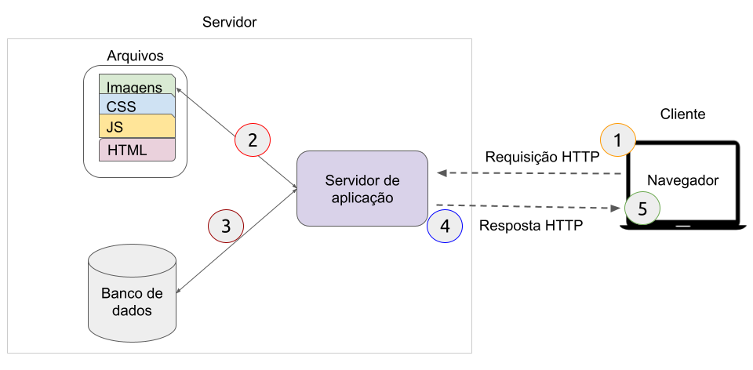

# Arquitetura de aplicações web

### Introdução&#x20;

A arquitetura de aplicações web descreve a estrutura interna e interações entre seus componentes, bancos de dados e sistemas externos.

A arquitetura da web é por natureza distribuída, baseada no modelo cliente-servidor. Chamamos de clientes os dispositivos de acesso as páginas web por meio de um navegador. Já os servidores são os computadores que hospedam as páginas web e os disponibilizam para os dispositivos clientes.

Utilizando o modelo cliente-servidor é possível estruturar uma aplicação web de diferentes maneiras, dependendo do tamanho, tecnologias utilizadas e quantidade de acessos. A seguir será apresentado alguns tipos de arquiteturas de aplicações web.

### Aplicações estáticas

Site estático é o modelo mais simples de aplicação web, construído com HTML, CSS e Javascript (opcional). Um site estático é aquele que retorna o mesmo conteúdo que está salvo no servidor sempre que uma determinada página é solicitada.&#x20;

A figura abaixo mostra uma arquitetura básica  de uma aplicação web estática, basicamente é o modelo cliente-servidor de forma simples e pura.

Detalhamento do fluxo de acesso a um site estático, representado no diagrama acima.&#x20;

Quando o usuário deseja acessar uma determinada página, ele informa o seu endereço (URL) ao navegador, e em seguida:

1. O navegador envia uma requisição para o servidor HTTP solicitando a referida página HTML (especificada via URL).&#x20;
2. o servidor recupera o documento solicitado (página HTML) de seu sistema de arquivos; e&#x20;
3. retorna uma resposta HTTP contendo a página HTML para o navegador.&#x20;
4. por fim, o navegador exibe o conteúdo da página HTML formatada para visualização do usuário. **O conteúdo exibido para o usuário é o mesmo que está salvo no sistema de arquivos do servidor.**

Outras características dos sites estáticos:

* Simples, ótimo para blogs, portfólios e sites pessoais;
* Não tem necessidade de banco de dados;
* O conteúdo e layout de cada página é o mesmo para qualquer cliente.

Na próxima seção vamos conhecer a arquitetura de aplicações dinâmicas.

### Aplicações dinâmicas

Sites dinâmicos são aqueles que geram dinamicamente parte do conteúdo que é retornado para o cliente. Geralmente as páginas HTML definem o modelo com lacunas para serem preenchidas dinamicamente. O conteúdo dinâmico geralmente é armazenado em um banco de dados.

Um site dinâmico pode retornar dados diferentes para uma mesma URL com base nas informações fornecidas pelo usuário, localização, data de acesso, etc. Exemplo: se dois usuários autenticados acessarem a página inicial do Twitter irão visualizar informações diferentes, o layout da página é mesmo, mas o feed de tweets (conteúdo principal da página) será diferente, porque é carregado de acordo com o usuário autenticado.

Em uma aplicação dinâmica, o servidor é o responsável por  receber a requisição, identificar qual o modelo HTML deve ser retornado e preencher as lacunas do modelo com as informações dinâmicas baseada nos dados fornecido pelo cliente. Em seguida o servidor retorna a página HTML completa.&#x20;

É importante destacar que mesmo em aplicações dinâmicas sempre vai haver requisições de recursos estáticos, que são tratados como descritos na seção anterior. Recursos estáticos são quaisquer arquivos que não mudam - normalmente: CSS, JavaScript, imagens etc.

Veja um exemplo de acesso à um site dinâmico de _e-commerce_: o servidor possui os arquivos HTML com os layouts das páginas e armazena os dados dos produtos em um banco de dados (com isso uma página HTML com mesmo layout/modelo pode ser exibida com informações de diferentes produtos carregados dinamicamente do banco de dados). Com isso, ao receber uma solicitação HTTP para exibir um determinado produto , o servidor busca os dados do produto no banco de dados e, em seguida, constrói a página HTML para a resposta inserindo os dados dinâmicos em um modelo HTML.&#x20;

O diagrama abaixo mostra os principais elementos e o fluxo de dados do exemplo acima.

