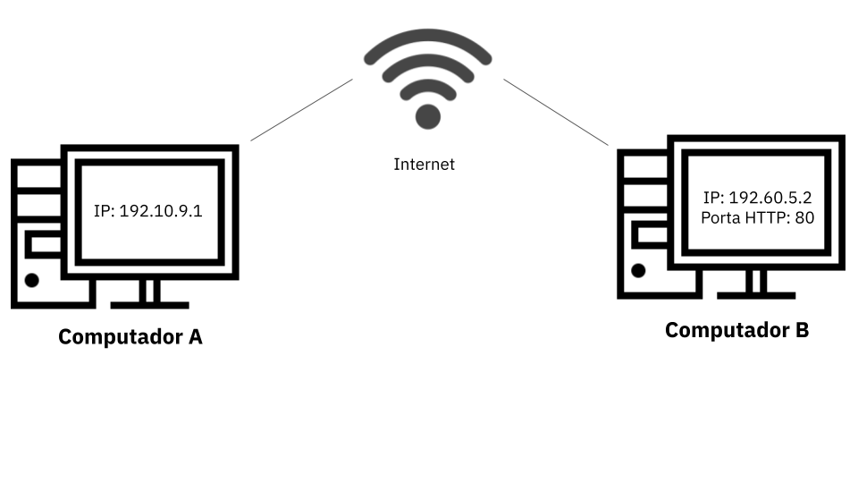

# Como a Web funciona?

> **Objetivos de aprendizagem**
>
> * Conhecer os componentes básicos da Web
> * Entender de forma simplificada o fluxo de execução da web

### Introdução

Para começar a entender o funcionamento da Web precisamos conhecer alguns componentes básicos que compõem a arquitetura da Web. Iniciaremos pelos conceitos de Clientes e Servidores.

Qualquer dispositivo conectado na internet é conhecido como Cliente ou Servidor, depende de sua função na rede.

* **Clientes** - são os dispositivos conectados à Internet pelos quais os usuários acessam as páginas Web \(por exemplo, seu computador conectado ao seu Wi-Fi ou seu telefone conectado à sua rede móvel\). Geralmente as páginas Web são acessadas por através de navegadores Web \(Chrome, Firefox, Brave, etc.\) instalados nesses dispositivos.
* **Servidores** - são computadores que armazena arquivos que compõem os sites \(por exemplo, documentos HTML, imagens, folhas de estilo, e arquivos JavaScript\) e disponibilizam esses arquivos/páginas/sites para serem acessados pelos dispositivos clientes. Para isso, o servidor deve está conectado a Internet, e assim, poderá ser acessado através do seu endereço IP ou nome de domínio \(por exemplo, `jesielviana.com`\). 

A conexão entre clientes e servidores é realizada por meio da internet. A imagem abaixo apresenta de forma simplificada como Cliente e Servidor interagem na Web.

Para entender melhor como funciona a interação entre os componentes da Web vamos detalhar como é comunicação na Internet.

### Comunicação na Web

Como vimos no capítulo de Introdução a Web, a Web é um serviço que é executado sob a Internet, então para melhor compreendermos seu funcionamento,  precisamos entender de forma simplificada como funciona a comunicação entre computadores na Internet.

A comunicação entre dois ou mais dispositivos na Internet é realizada por meio endereços \(conhecido como endereço IP\) que identificam os dispositivos na rede e portas que fornecem pontos de conexão para aplicações e serviços específicos. 

De forma resumida, para que um dispositivo A possa se comunicar com um dispositivo B, o dispositivo A precisa saber o endereço IP de B e saber qual a porta de B está disponível para ele \(oferece o serviço que ele espera\). A figura abaixo ilustra a comunicação entre dois computadores \(dispositivos A e B\). Onde o computador A pode acessar o serviço Web \(porta 80\) do computador B. 

De acordo com a explicação acima, para nós podermos acessar um determinado site, deveríamos saber qual o endereço IP do servidor que armazena site e a porta em que aquele site está disponível, mas, na prática, não fazemos isso.

Quando acessamos um determinado site a partir do nosso computador ou smarphone, geralmente informamos para o navegador o endereço do site, também conhecido como domínio. E o navegador se encarrega de descobrir qual o endereço do servidor que armazena o site. Para fazer isso, o navegador utiliza um recurso chamado DNS - Domain Name System \(Servidor de Nome de Domínio em português\).

### DNS - Domain Name System

Servidores DNS guardam uma grande lista de nomes de sites \(domínios\) e seus respectivos endereços IPs, com isso, ele sabe em qual computador \(pelo endereço IP\) da Internet está hospedado determinado site \(pelo domínio\).  Quando você digita um endereço web no seu navegador, o navegador procura no servidor de DNS para localizar o endereço IP do servidor que hospeda o site, para ele poder acessar o site diretamente.  

Vamos ver um exemplo de como funciona o fluxo de troca de mensagens entre o navegador e DS quando informamos uma **URL** \(_Uniform Resource Locator_\) de um site que desejamos acessar na barra de endereços do nosso navegador.

1. **Usuário** digita `www.jesielviana.com/` na barra de endereços do navegador; 
2. **Navegador** vai até o servidor DNS e pergunta:  olá DNS, você sabe o endereço IP do servidor que hospeda o domínio `www.jesielviana.com`?
3. **DNS** responde ao navegador: opa, o endereço IP do servidor que armazena esse domínio é `192.18.45.2`.
4. Navegador se conecta ao servidor `192.18.45.2` e solicita a página web desejada.

É importante destacar que esse fluxo completo só ocorre a primeira vez que você acessa o site no seu navegador, geralmente no primeiro acesso o navegador guarda no seu próprio cache o endereço IP correspondente aquele domínio para que nas próximas vezes que você acessar aquele site ele já vai direto no servidor do site sem precisar ir até o DNS novamente. 

Toda troca de mensagens entre navegadores e servidores Web são realizadas por meio do protocolo _**HTTP - Hypertext Transfer Protocol.**_ 

### HTTP

O protocolo HTTP é conhecido como o _"idioma"_ dos navegadores e servidores web, é através deste _"idioma"_ que o seu navegador informa ao servidor web: página solicitada, sua versão, seu idioma, etc. E o servidor web informa ao seu navegador: se a página solicitada existe, formato do arquivo, o conteúdo da página solicitada, etc.

Vamos nos aprofundar mais sobre HTTP no próximo capítulo. 

### Conclusão

Quando você digita um endereço da web no seu navegador:

1. O navegador vai para o servidor de DNS e encontra o endereço verdadeiro de onde o site está hospedado.
2. O navegador manda uma mensagem de requisição HTTP para o servidor que está hospedando o site, pedindo que o servidor envie uma cópia de determinada página, de acordo com a URL informada pelo usuário.
3. Se o servidor aprovar a requisição do cliente, o servidor enviará ao cliente uma mensagem de "OK",  e então começa a enviar os arquivos da página solicitada para o navegador.
4. O navegador carrega os arquivos recebidos \(html, css, js, etc\), monta a página e exibe-a para o usuário.







### Referências 







