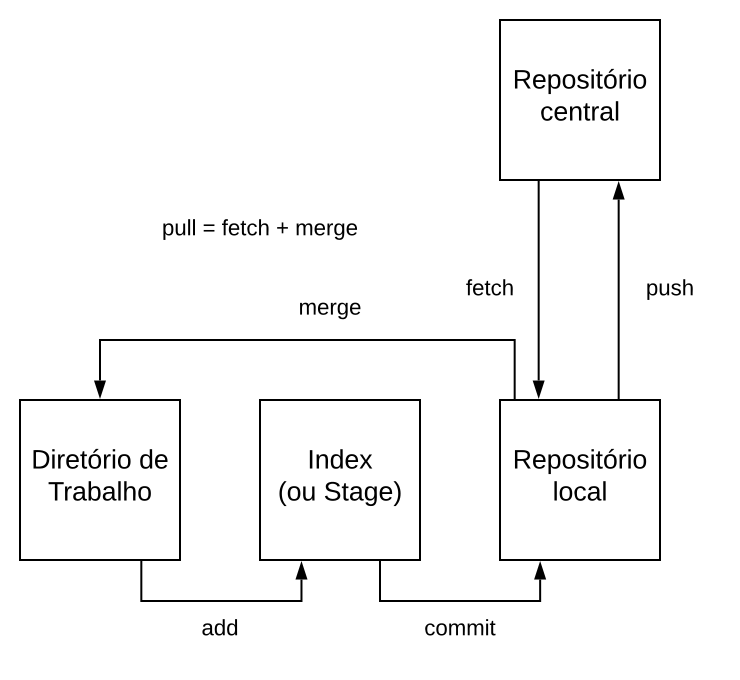

# Ferramentas e Fluxo de Desenvolvimento

> **Objetivos de aprendizagem**
>
> * Conhecer as ferramentas básicas para desenvolvimento Web
> * Entender a importância do controle de versão e colaboração
> * Aprender a utilização básica de ferramentas de controle de versão

### Introdução

O desenvolvimento de aplicações Web não é nada trivial, da escrita do código a disponibilização online de uma página Web envolve um fluxo de trabalho composto por várias etapas, com utilização de várias ferramentas.&#x20;

O objetivo deste capítulo é passar por esse fluxo de trabalho por etapas,  apresentando o que é feito e as ferramentas utilizadas em cada etapa, da escrita do código à implantação de  aplicações Web. Se você quer entender esse fluxo, vem com gente!

As etapas a serem apresentadas são: escrita de código utilizando um editor de texto ou IDE,  visualização do código em um navegador Web, armazenamento do código e controle de versão em uma plataforma online e por fim a disponibilização online para o público em geral.&#x20;

### Escrita do código-fonte

Assim como tem os editores de textos para escrita de documentos tais como Microsoft Office e Google Docs. Temos os editores de texto específicos para escrita de código-fonte, são os editores utilizados pelos desenvolvedores para escrita do HTML, CSS, Javascript, etc.&#x20;

Os editores de textos mais simples para desenvolvedores são conhecidos como editor de código-fonte. Também existem o editores que são chamados de IDE _(Integrated Development Environment)_, que além de editor de código-fonte fornece uma plataforma completa para desenvolvimento, composto por um conjunto de recursos que possibilita a escrita e teste do código, _debug_ e integração com diversas outras ferramentas.&#x20;

Editor de código ou IDE é uma ferramenta essencial para a escrita de código e desenvolvimento de software, conhecer os atalhos e funcionalidades disponíveis é importante para aumento da produtividade e resolução de problemas por meio de ‘debug’ e recursos que auxiliam o desenvolvedor durante o processo de escrita e sincronização de código e implantação do software.&#x20;

A escolha do editor pode variar de acordo com a linguagem de programação a ser utilizada. Atualmente um dos editores mais utilizado é o Visual Studio Code ([VS Code](https://code.visualstudio.com)), que é _open-source_ desenvolvido pela Microsoft. Outro que é muito bom também é o [Sublime Text](https://www.sublimetext.com), simples e muito rápido.

A instalação de qualquer um desses editores é bem simples, basta acessar o link e seguir o passo-a-passo para instalação que tem no próprio site da ferramenta.

Para desenvolvimento Web eu recomendo fortemente o **** [**VS Code**](https://code.visualstudio.com), fácil de instalar e já vem com todos os recursos necessários para iniciar no desenvolvimento, além disso, possui um _marketplace_ de extensões fantástico, com muitas extensões para tudo que precisamos durante o desenvolvimento Web.

### Armazenamento de código e controle de versão

A construção de software é realizado em partes, de forma iterativa, cada hora/dia você adiciona mais um pouco de código, mais uma funcionalidade, que às vezes é feita de forma individual, mas em sua grande maioria é realizado em equipe, com a colaboração de vários desenvolvedores, trabalhando em um mesmo projetos de locais e horários diferentes uns dos outros;

Armazenar o código-fonte de um software no seu computador pessoal é ruim e perigoso, se está só na sua máquina não tem como outras pessoas colaborarem, sua máquina pode queimar o HD e você perderá todo código.

Além disso, surge existem outras necessidades inerentes ao desenvolvimento de software moderno:

* Como manter o código seguro?
* Como manter um histórico de modificações do software, de um arquivo?
* Como juntar o código de diversos programadores em um mesmo projeto? E se mais de um programador alterar um mesmo arquivo?
* Como separara o código-fonte das versões de produção e de desenvolvimento?
* Como gerenciar as versões de um software?

A solução para as necessidades citadas acima está na utilização de ferramentas de controle de versão. Dentre as diversas ferramentas existentes, [Git](https://github.com/git/git) se tornou a mais popular e a que melhor resolve os problemas de armazenamento de código e controle de verões.

Git é um sistema de controle de versão que permite integrar as modificações de diversos colaboradores em um única base de código, fazendo o controle de modificações e conflitos. Além disso, cria todo histórico de alterações no código do projeto, permitindo facilmente voltar para qualquer ponto para saber como o código estava naquele momento.

Git é um sistema open-source de controle de versão, sendo o mais utilizado pelos desenvolvedores atualmente. Foi desenvolvido em 2005 por Linus Torvalds, o famoso criador do kernel do sistema operacional Linux.

Para utilização do Git é necessário fazer sua instalação no seu computador, geralmente os computadores Linux e Mac já vem com ele instalado. Caso seu computador não tenha o Git instalado instale seguindo as instruções desse link: [https://git-scm.com/downloads](https://git-scm.com/downloads).

Somente com o Git instalado no seu computador já é possível utilizá-lo para armazenamento do código e controle de versão, porém o armazenamento e controle de versão local não resolve todos os problemas citados anteriormente, tais como colaboração e segurança em caso de danificação do seu computador. Para isso, costumamos utilizar plataformas de Git online, que implementam todos os recursos do Git na nuvem (cloud) de forma segura e disponível. Existem várias opções de Git online, as mais famosas são Github (a mais utilizada para projetos open-source), Gitlab e Bitbucket. Recomendo o uso do Github por ser a mais utilizada, simplicidade de uso e funciona como uma rede social de desenvolvedores. Todas podem ser utilizadas de forma gratuita, basta fazer seu cadastro com email.&#x20;

GitHub é uma plataforma de hospedagem de código (repositórios Git) para controle de versão e colaboração. Ele permite que você e outras pessoas trabalhem juntos em projetos de qualquer lugar. Além de servir como hospedagem de código, o Github possui muitas recursos e integrações com serviços que auxiliam no gerenciamento do projeto, execução de testes e implantação de forma automatizada.

### &#x20;Utilizando o Git e Github

A utilização do Git é baseada em comandos via terminal, existem comandos para realização de todas as operações através do Git. Abaixo serão apresentados os principais comandos do Git.

Para começar a usar o git para controle de versão de um projeto devemos executar um dos seguintes comandos: _**init**_ ou _**clone**_ no diretório raiz do projeto.

* `git init` - transforma o diretório em um repositório git;

O comando **clone**, clona(copia código e histórico) para o diretório corrente um repositório armazenado remotamente, por exemplo: um repositório do GitHub.

* `git clone` [`https://github.com/NOME-USER/NOME-REPO`](https://github.com/NOME-USER/NOME-REPO) - clona o repositório do link para seu computador.

Depois que você possui um código na sua máquina local gerenciado pelo Git,  o sistema git manipula três áreas distintas (fonte: [https://engsoftmoderna.info/capAp.html](https://engsoftmoderna.info/capAp.html)):

* Um **diretório de trabalho**, onde estão os arquivos que estamos editando. O diretório com os arquivos que você abre no seu editor de código.
* Uma área intermediária, chamada de **index** ou **stage**, que armazena temporariamente os arquivos que se pretende versionar. Tais arquivos são ditos rastreáveis (**tracked)**.
* O **repositório git** propriamente dito, que armazena o histórico de commits localmente(na sua máquina).

Para trafegar por esses estágios utilizamos os seguinte comandos:

* `git add <nome-do-arquivo>` - adiciona o arquivo na área intermediária, esse comando marca o arquivo como um arquivo que queremos versionar (rastreável).
* `git commit -m "msg de descrição do commit"` - salva os arquivos que estão na área intermediária (rastreáveis) no repositório git local.

Por fim, vamos usar os comandos de sincronização com o servidor remoto, como Github.

* `git push` - copia os commits mais recentes (aqueles que ainda não foram enviados para o servidor remoto) do repositório local para o repositório remoto.
* `git pull` - atualiza seu repositório local e o diretório de trabalho de acordo com o repositório remoto. &#x20;

Como funciona o `git pull`? quando é realizado um git `pull` , primeiro o git copia os `commits` mais recentes do repositório central/remoto para o repositório local do desenvolvedor. Essa operação inicial é chamada de **`fetch`**. Em seguida, o comando o git atualiza os arquivos do diretório de trabalho. Essa operação é chamada de **`merge`**. É na operação de _merge_ que as vezes ocorrem os famosos conflitos, algo que assusta os inciantes. Para saber mais sobre conflitos, _merge_ e funcionamento do git em geral, leia o capítulo sobre Git do livro [Engenharia de Software Moderna (ESM) do professor Marco Tulio Valente](https://engsoftmoderna.info/capAp.html).

A figura abaixo, retirada do livro [ESM](https://engsoftmoderna.info/capAp.html),  apresenta o fluxo de funcionamento dos comandos Git.

Lista de comandos úteis do Git: [https://gist.github.com/jesielviana/79b444d60933248e649d45e4ebbf0fb5](https://gist.github.com/jesielviana/79b444d60933248e649d45e4ebbf0fb5)

Documentação oficial do Git em português: [https://git-scm.com/book/pt-br/v2](https://git-scm.com/book/pt-br/v2)

Recomendo a leitura da documentação para entender sobre os conceitos de `branch`, `tag` e `gitflow`, que estão fora do escopo desse livro.

### Disponibilizando sua aplicação online

A forma mais prática e fácil de disponibilizar uma aplicação Web online é colocando-a em uma plataforma de nuvem (cloud). Portanto, é importante que qualquer desenvolvedor conheça algumas dessas plataformas para disponibilizar suas aplicações. Além disso, quase todas as empresas utilizam essas plataformas para disponibilização de suas aplicações e serviços online, sendo um requisito básico para qualquer desenvolvedor conhecer essas plataformas.&#x20;

Abaixo é listada algumas dessas plataformas e suas principais características.

* [Heroku](https://www.heroku.com) - é uma plataforma em nuvem como um serviço que suporta várias linguagens de programação. Tem planos gratuito e pago. Recomendo a sua utilização para a implantação de aplicações de back-end.
* [Netlify](https://www.netlify.com) - plataforma de computação em nuvem que oferece hospedagem e serviços de back-end sem servidor (serverless) para aplicativos da web e sites estáticos. Recomendo para a implantação de sites estáticos e aplicações de front-end. Simples de utilizar e performática, com uma ótima integração com Github.
* [Vercel](https://vercel.com) - basicamente oferece os mesmos recursos que a Netlify.
* [GitHub Pages](https://pages.github.com) - plataforma do Github para hospedagem de sites estáticos e aplicações de front-ed a partir de repositórios do Github.

Para hospedagem dos exemplos deste livro, utilizamos e recomendamos o Github Pages e Netlify para hospedagem de frontend (HTML, CSS, Javascript, Vue.js, etc.) e o Heroku para hospedagem de backend Node.js.

### Conclusão

Em qualquer área atuação sempre há um conjunto de ferramentas que são essenciais para auxiliar o profissional para realização do seu trabalho. No desenvolvimento de software para Web não é diferente, para a construção de uma página Web ou uma API é essencial o uso de ferramentas que apoiam o desenvolvvimento e produtividade, principalmente aquelas que dão suporte à colaboração.

Escolhas suas ferramentas e domine-as. O conhecimento de Git é essencial e obrigatório para todo desenvolvedor de software. Use sempre, mesmo naqueles projetinhos pessoais e atividades acadêmicas.

### Materiais complementares










