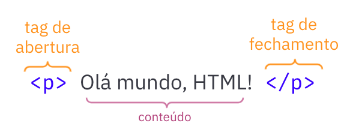

# HTML

> Objetivos de aprendizagem
>
> * Conhecer a linguagem de marcação HTML
> * Entender a sintaxe básica da linguagem
> * Conhecer as tags básicas da HTML

### Introdução

Como descrito na aula anterior, a Web é baseada na interligação de documentos de hipermídia que podem conter textos, imagens, vídeos, etc. Para criação desses documentos, conhecidos como páginas Web, utiliza-se a linguagem de marcação HTML - Hypertext Markup Language. 

A linguagem HTML permite estruturar uma página web e seu conteúdo com texto, imagens, vídeos, etc e interligá-los com outras páginas na Web de forma simples e padronizada.

HTML **não** é uma linguagem de **programação**, na verdade, HTML é uma linguagem de marcação, formada por um conjunto de elementos. Os elementos HTML são definidos por meio de _tags,_ que são utilizadas para definir a estrutura do conteúdo.

As tags HTML são utilizadas para delimitar ou agrupar diferentes partes do conteúdo para ele apareça ou atue de determinada maneira. A interpretação do HTML e apresentação do conteúdo fica a cargo dos navegadores Web.

Por exemplo, como transformar a frase abaixo em um parágrafo HTML?

> Sou um desenvolvedor Web.

Basta envolver a frase em uma tag `<p>`, tal como: `<p>Sou um desenvolvedor Web</p>`

Todo o conteúdo de um documento HTML deve ser envolvido por tags, há tags específicas para cada tipo de conteúdo, como a tag `<p>` para parágrafo. Mais a frente vamos conhecer as principais tags HTML e como utilizá-las.

### Estrutura de uma página HTML

Abaixo é apresentado o código-fonte da estrutura mínima de uma página HTML e a seguir é descrito cada elemento.

```markup
<!DOCTYPE html>
<html>
 
 <head>

 </head>

 <body>
  <!-- Conteúdo aqui -->
 </body>

</html>
```

Um documento HTML é formado por elementos, que na sua maioria é composto por uma tag de abertura no início do elemento e uma tag de fechamento que indica o fim do elemento. Veja a descrição dos elementos do código acima.

* `<!DOCTYPE html>` - declaração que define que este documento é do tipo HTML5, deve ser a primeira _tag_ do documento \(obrigatório\);
* `<html>` - é o elemento raiz de uma página HTML, composto pela _tag_ `<html>`, que indica o início do documento e pela _tag_ `</html>` que delimita o final do documento. Observe que a tag de fechamento tem uma `/`. Isso é padrão para todos os elementos que possuem tag de fechamento;
* `<head>`  - elemento que contém configurações e meta informações sobre o documento, o conteúdo colocado dentro deste elemento não fica visível no página Web, quando acessada pelo navegador. Este elemento também formado pelas tags de abertura e fechamento;
* `<body>`  - elemento que indica o corpo do documento, contém todo conteúdo  visível da página Web. Também formado pelas tags de abertura e fechamento.

### Anatomia de um elemento HTML

A figura abaixo apresenta detalhadamente as partes que compõe um elemento HTML, no exemplo é utilizada a tag `p` que representa um parágrafo num documento HTML. No entanto, essa estrutura é aplicada a qualquer elemento que possui tag de abertura e fechamento. Como vamos ver mais a frente, alguns elementos HTML possuem apenas a tag de abertura.



As principais partes de um elemento são:

* **Tag de abertura** - consiste no nome do elemento \(no caso, `p`\), envolvido pelos caracteres `<` \(menor que\) e `>` \(maior que\). Isso demonstra onde o elemento começa, ou onde seu efeito se inicia — nesse caso, onde é o começo do parágrafo.
* **Tag de fechamento**  - Similar tag de abertura, exceto que inclui uma barra antes do nome do elemento. Isso demonstra onde o elemento acaba — nesse caso, o fim do parágrafo. 
* **Conteúdo** - é literalmente o conteúdo do elemento \(texto, imagens, links, etc.\), no exemplo do parágrafo acima é apenas texto.
* Por fim, a tag de abertura, a de fechamento, e o conteúdo formam o **Elemento**.

> Atenção: esquecer de incluir uma tag de fechamento, ou simplismente esquecer de colocar a `/` \(barra\) é um dos erros mais comuns de iniciantes causando resultados indesejados e estranhos.

### Primeira página HTML

Agora vamos criar nosso "olá mundo" com HTML. Para isso vamos criar um documento HTML seguindo a estrutura vista acima e adicionar um elemento de parágrafo com a seguinte frase "Olá mundo, HTML!". Código abaixo:

```markup
<!DOCTYPE html>
<html>
 
 <head>

 </head>

 <body>
   <p>Olá mundo, HTML!</p>
 </body>

</html>

```

Para visualizar a nossa página, basta salvar o documento com o nome index.html \(pode ser qualquer nome com a extensão .`html`\) e abri o arquivo em qualquer navegador Web.

Nossa primeira página Web está criada, porém ainda está muito simples e faltando algumas configurações básicas, tais como o _charset_  e título da página. Vamos adicionar essas configurações e também transformar o texto "Olá mundo, HTML!" em um texto maior e negrito, tipo cabeçalho, com mais destaque. 

```markup
<!DOCTYPE html>
<html>
 
 <head>
   <meta charset="UTF-8">
   <title>Aula de HTML</title>
 </head>

 <body>
   <h1>Olá mundo, HTML!</h1>
   <p>Feito por "seu_nome"</p>
 </body>

</html>

```

Os elementos adicionados foram: 

* `<meta charset>` _\(linha 5\)_ **-** tag utilizada para indicar o formato de codificação de caracteres utilizados no documento. Trata dos problemas de acentuação. No exemplo, é utilizado `UTF-8`, que pode representar qualquer caractere universal padrão do [Unicode](https://pt.wikipedia.org/wiki/Unicode);
* `<title>` _\(linha 6\)_ - elemento que especifica um título para o documento;
* `<h1>`  \(10\) - elemento que define um texto com destaque, fonte grande e negrito;
* `<p>`  _\(linha 11\)_ - elemento que define um parágrafo.

Pronto! Agora temos um documento simples com as configurações essenciais para um página Web padronizada de acordo com os padrões profissionais e internacionais.

### Conclusão

Nesta aula conhecemos a linguagem de marcação HTML e para que ela é utilizada. Além disso, aprendemos o básico de sua sintaxe e a utilizar de forma prática as tags básicas para criar elementos e páginas Web.

Agora é com você, modifique os exemplos criados na aula, adicione mais elementos nas páginas e crie outros documentos HTML. 

Por fim, acesse o material complementar.

### Material Complementar












### Referências

* [https://developer.mozilla.org/pt-BR/docs/Learn/Getting\_started\_with\_the\_web/HTML\_basics](https://developer.mozilla.org/pt-BR/docs/Learn/Getting_started_with_the_web/HTML_basics)


