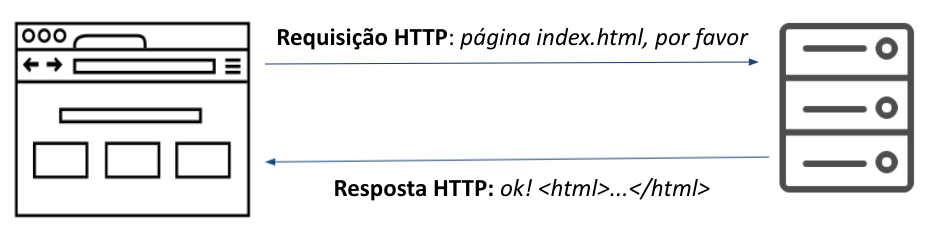

# HTTP - Entenda o idioma dos navegadores

> Objetivos de aprendizagem
>
> * Conhecer as partes do protocolo,  HTTP;
> * Compreender a anatomia de requisições e respostas HTTP

### Introdução

HTTP - _Hypertext Transfer Protocol_ é o protocolo \(idioma\) de comunicação entre navegadores e servidores Web. É um protocolo cliente-servidor utilizado para troca de dados na Web, geralmente a troca de mensagens na Web inicia-se pelo cliente \(navegador\) que solicita um determinado recurso \(página web, imagem, arquivo css, etc.\) ao servidor e este responde com o recurso solicitado. 

Quando o navegador envia uma mensagem HTTP de solicitação ao servidor chamamos de **requisição** \(ou **request** em inglês\) e quando o servidor web responde à requisição chamamos de **resposta** \(ou **response** em inglês\), conforme demonstrado na figura abaixo.

### Requisições HTTP

Uma requisição HTTP é composta por alguns elementos obrigatórios e outros opcionais, os elementos obrigatórios são:

* **Versão do HTTP** \(`HTTP/2`\) - versão do protocolo HTTP utilizada para comunicação;
* **Host** \(ex: `jesielviana.com`\) -  para onde a requisição será enviada. 
* **Recurso** \(ex: `/blog`\) - o caminho do recurso a ser acessado no servidor;
* **Método** \(ex: `GET`\) - define qual operação o cliente quer fazer. Por exemplo, o método `GET` é utilizado para operações de consulta/busca. 

Opcionalmente uma requisição pode ter: 

* **Cabeçalhos/Headers** \(ex: `accept: text/html`\) -  permitem que o cliente e o servidor passem informações adicionais com a solicitação ou a resposta HTTP. São compostos por um nome**, ":"** e um valor. Por exemplo, `accept` é utilizado para informa ao servidor sobre os tipos de dados que podem ser enviados de volta. Existem vários tipos de cabeçalho HTTP, apesar de ser considerado um elemento opcional na requisição, sempre é envido algum tipo de cabeçalho;
* **Corpo/body** - dados enviados para o servidor, por exemplo, dados que o usuário preencheu em formulário. Geralmente é utilizado em conjunto com o método HTTP `POST`.

Veja um exemplo de requisição HTTP utilizando o navegador Firefox para acessar a página do meu perfil no Github \([`https://github.com/jesielviana`](https://github.com/jesielviana)\).

Existem muitos cabeçalhos HTTP, não é objetivo deste material abordar todos eles, caso  queira conhecer mais cabeçalhos acesse [https://developer.mozilla.org/pt-BR/docs/Web/HTTP/Headers](https://developer.mozilla.org/pt-BR/docs/Web/HTTP/Headers).

### Referências



* HTTP: Learn your browser's language, disponível em: ****[https://b0rk.gumroad.com/l/http-zine](https://b0rk.gumroad.com/l/http-zine)

