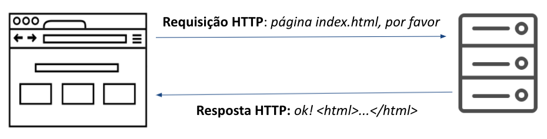
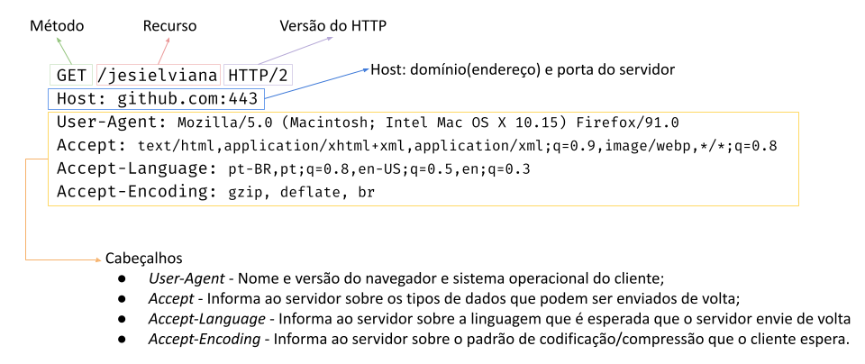
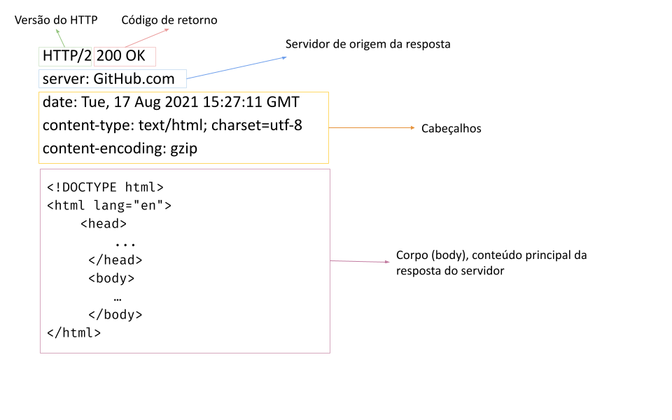

# HTTP - Conheça o idioma dos navegadores

> Objetivos de aprendizagem
>
> * Conhecer as partes do protocolo,  HTTP;
> * Compreender a anatomia de requisições e respostas HTTP

### Introdução

HTTP - _Hypertext Transfer Protocol_ é o protocolo (idioma) de comunicação entre navegadores e servidores Web. É um protocolo cliente-servidor utilizado para troca de dados na Web, geralmente a troca de mensagens na Web inicia-se pelo cliente (navegador) que solicita um determinado recurso (página web, imagem, arquivo css, etc.) ao servidor e este responde com o recurso solicitado.&#x20;

Quando o navegador envia uma mensagem HTTP de solicitação ao servidor chamamos de **requisição** (ou **request** em inglês) e quando o servidor web responde à requisição chamamos de **resposta** (ou **response** em inglês), conforme demonstrado na figura abaixo.

### Requisições HTTP

Uma requisição HTTP é composta por alguns elementos obrigatórios e outros opcionais, os elementos obrigatórios são:

* **Versão do HTTP** (Ex: `HTTP/1.1`) - versão do protocolo HTTP utilizada para comunicação;
* **Host** (ex: `jesielviana.com`) -  para onde a requisição será enviada.&#x20;
* **Recurso** (ex: `/blog`) - o caminho do recurso a ser acessado no servidor;
* **Método** (ex: `GET`) - define qual operação o cliente quer fazer. Por exemplo, o método `GET` é utilizado para operações de consulta/busca. Existem outros métodos, que vamos ver mais a frente.&#x20;

Opcionalmente uma requisição pode ter:&#x20;

* **Cabeçalhos/Headers** (ex: `accept: text/html`) -  permitem que o cliente e o servidor passem informações adicionais com a solicitação ou a resposta HTTP. São compostos por um nome**, ":"** e um valor. Por exemplo, `accept` é utilizado para informa ao servidor sobre os tipos de dados que podem ser enviados de volta. Existem vários tipos de cabeçalho HTTP, apesar de ser considerado um elemento opcional na requisição, sempre é envido algum tipo de cabeçalho;
* **Corpo/body** - dados enviados para o servidor, por exemplo, dados que o usuário preencheu em formulário. Geralmente é utilizado em conjunto com o método HTTP `POST`.

Veja um exemplo de requisição HTTP utilizando o navegador Firefox para acessar a página do meu perfil no Github ([`https://github.com/jesielviana`](https://github.com/jesielviana)).

Existem muitos cabeçalhos HTTP, não é objetivo deste material abordar todos eles, caso  queira conhecer mais cabeçalhos acesse [https://developer.mozilla.org/pt-BR/docs/Web/HTTP/Headers](https://developer.mozilla.org/pt-BR/docs/Web/HTTP/Headers).

### Respostas HTTP

Assim como as requisições, uma resposta HTTP é composta por alguns elementos obrigatórios e outros opcionais, os elementos obrigatórios são:

* **Versão do HTTP** (Ex: `HTTP/2`) - versão do protocolo HTTP utilizada para comunicação;
* **Código de status** (Ex: `200 OK!` `404 not found!`) - indica a situação da requisição, 200 indica sucesso, 404 indica que o recurso solicitado não existe, além desses códigos existem outros, vamos ver os principais mais abaixo.
* **Cabeçalhos/Headers** (ex: `Content-Length: 33`) - como aqueles das requisições, no exemplo mostrado o servidor está informando o tamanho do conteúdo enviado no `body (corpo)` da resposta.
* **Body/corpo** (Ex: `<html></html>, image, etc` etc.) - dados do recurso requisitado.

Veja abaixo, o exemplo da resposta HTTP da requisição feita acima.  Resposta de acesso à página do meu perfil no Github ([`https://github.com/jesielviana`](https://github.com/jesielviana)) utilizando o Firefox.

Nos exemplos mostrados acima, não foram apresentados todos os elementos do HTTP que são trocados entre cliente e servidor. Foi apresentado somente alguns itens para fins didáticos, no entanto, como já citado acima, há diversas itens de cabeçalhos que podem ser configurados tanto no cliente como no servidor, tais como elementos de cache e segurança.

Para ver a troca de mensagens HTTPs entre navegador e servidor acesse no seu navegador favorito a opção de "Ferramentas do desenvolvedor", geralmente está disponível no Botão de Menu (três pontinhos) do lado direto -> Mais Ferramentas -> Ferramentas do Desenvolvedor. Quando abrir a janela de Ferramentas do Desenvolvedor acesse a aba de "Rede".

### Métodos de requisições HTTP

Na primeira linha de toda requisição HTTP é informado o método utilizado na requisição. O método indica a ação a ser executada na requisição. Veja abaixo a lista dos principais métodos HTTP e suas respectivas ações semânticas.

* `GET` -  método utilizado para consulta, solicita a representação de um recurso específico. Quando você digita um URL em seu navegador e aperta enter ou clica em algum link, sempre é uma requisição `GET`.
* `POST` - utilizado para enviar dados para o servidor, por exemplo, quando você preenche e submete um formulário na Web, geralmente os dados preenchidos são enviados para o servidor utilizando o método `POST`.
* `DELETE` - utilizado para remover um recurso específico no servidor.
* `PUT` - utilizado para alterar algum recurso no servidor.

Para conhecer todos os métodos HTTP acesse a página: [https://developer.mozilla.org/pt-BR/docs/Web/HTTP/Methods](https://developer.mozilla.org/pt-BR/docs/Web/HTTP/Methods).

### Códigos de status de respostas HTTP

Toda resposta HTTP tem um código de status. O código de status da resposta HTTP indica o que ocorreu com a requisição HTTP, se foi realizada com sucesso ou se houve algum erro, As respostas são agrupadas em cinco classes:

* Respostas de informação (100-199);
* Respostas de sucesso (200-299);
* Redirecionamentos (300-399);
* Erros do cliente (400-499);
* Erros do servidor (500-599).

Os códigos mais utilizados são:

* `200 OK` - indica que a requisição foi bem sucedida. O significado do sucesso varia de acordo com o método HTTP.
* `201 Created` - a requisição foi bem sucedida e um novo recurso foi criado como resultado. Geralmente utilizada na resposta de uma requisição POST.
* `400 Bad Request` - indica que o servidor não entendeu a requisição, pois está com uma sintaxe inválida. Geralmente indica erro causado pelo usuário.
* `401 Unauthorized` - indica que o usuário não está autenticado  e está tentando acessar algum recurso que precisa de autenticação. Ou seja, o cliente deve fazer o login para obter a resposta solicitada.
* `403 Forbidden` - indica que o usuário está autenticado, mas não tem permissão para acessar o recurso solicitado.&#x20;
* `404 Not Found` - O servidor não pode encontrar o recurso solicitado.&#x20;
* `500 Internal Server Error` - indica que um erro inesperado ocorreu no servidor.

Para conhecer todos os possíveis códigos de retorno do HTTP e seus significados acesse a página: [https://developer.mozilla.org/pt-BR/docs/Web/HTTP/Status](https://developer.mozilla.org/pt-BR/docs/Web/HTTP/Status)

### HTTPS - Hypertext Transfer Protocol Secure

É uma versão do protocolo HTTP criptografado. É normalmente usado [SSL](https://developer.mozilla.org/en-US/docs/Glossary/SSL) ou [TLS](https://developer.mozilla.org/pt-BR/docs/Glossary/TLS) para criptografar toda a comunicação entre um cliente e um servidor. Essa conexão segura permite aos clientes trocar com segurança dados confidenciais com o servidor.

Sem que for informar alguma informação confidencial em uma página Web verifique se o site utiliza HTTPS.

### Conclusão

HTTP é a base de qualquer troca de dados na Web. O conhecimento desse protocolo e suas configurações é importante para o desenvolver para entender o funcionamento da Web como um todo, desde o clique em uma URL até a exibição da página no navegador.&#x20;

Entender o HTTP é fundamental para quando o desenvolvedor precisar trabalhar com APIs e fazer configurações de aplicações de back-end.&#x20;

No entanto, é possível você iniciar com desenvolvimento Web sem se preocupar muito com o método HTTP, mas o conhecimento e domínio do HTTP vai te colocar em outro nível. ENTENDA HTTP, o idioma dos navegadores!

### &#x20;Referências



* HTTP: Learn your browser's language, disponível em: **** [https://b0rk.gumroad.com/l/http-zine](https://b0rk.gumroad.com/l/http-zine)



